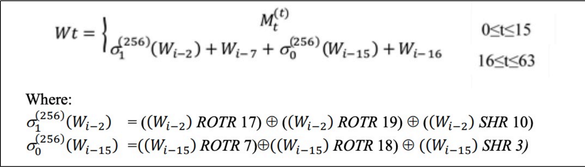
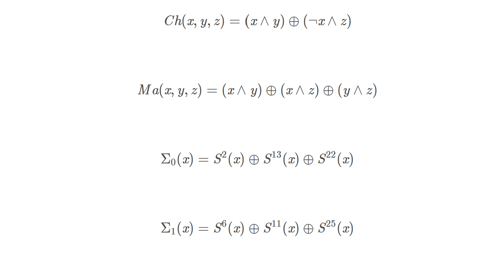
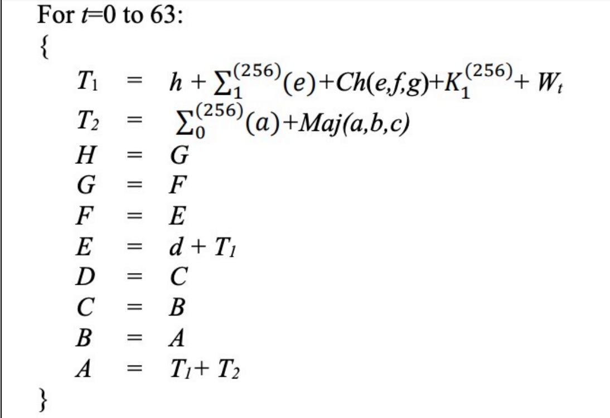
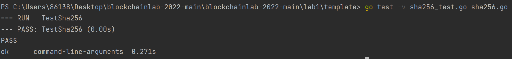
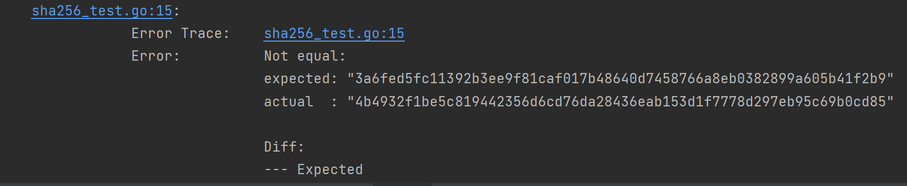
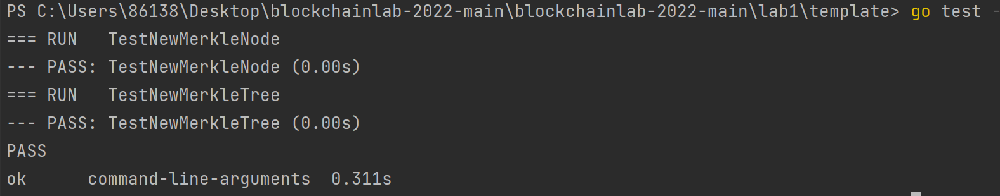
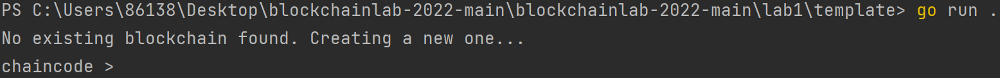
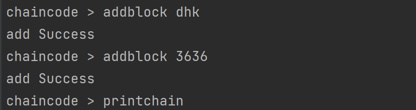
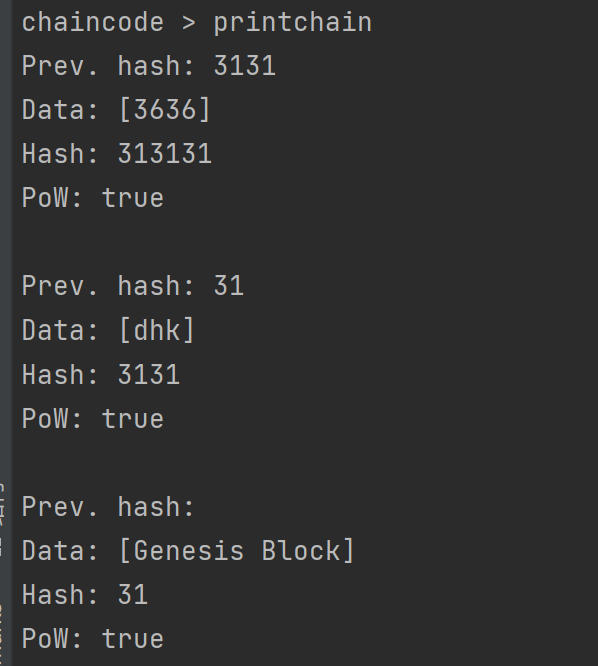

# **lab1 区块链的编写**
***

## **姓名：** 陈奕衡

## **学号：** PB20000024

## **实验目标**

- 完成SHA256算法实现
- 实现Merkle树的构建
- 搭建简单的区块链结构

## **实验平台**

- Windows 10 professional
- GoLand 
	- go version: go1.17.8.windows-amd64

## **一、SHA256算法实现**

### **算法简介**

SHA是安全哈希算法(Secure Hash Algorithm)的缩写，是由美国国家安全局(national Security Agency,NSA)设计、美国国家标准与技术研究院(National institute of Standard and Technology,NIST) 发布的密码学哈希算法组，起家族成员包括SHA-1、SHA-256、SHA384和SHA-512等。

SHA算法具有以下特点：

- 压缩性：任意长度的数据，算出的SHA256值长度都是固定的。
- 容易计算：从原数据计算出SHA256值很容易。
- 抗修改性：对原数据进行任何改动，哪怕只修改1个字节，所得到的SHA256值都有很大区别。
- 强抗碰撞：已知原数据和其SHA256值，想找到一个具有相同SHA256值的数据（即伪造数据）是非常困难的。

对于任意长度的消息，SHA256都会产生一个256位的哈希值，称作消息摘要。这个摘要相当于是个长度为32个字节的数组，通常有一个长度为64的十六进制字符串来表示，其中1个字节=8位，一个十六进制的字符的长度为4位。

### **算法流程以及实现**

1. 对消息进行填充，先补1个"1"和k个"0"，满足  **(l+1+k) mod 512 = 448**，l代表消息长度
2. 附加长度信息，将**消息的长度信息通过64位二进制的形式**补充到原消息后，使得最后的消息长度正好是512的倍数。我们采用**Big endian**对数据进行编码。

    前两步实现代码如下：
    ```go
    fill_message := append(message, 0x80)
	length := len(message) + 1
	for k := 0; (length+k)%64 != 56; k++ {
		fill_message = append(fill_message, 0x00)
	}
	len_big := make([]byte, 8)
	binary.BigEndian.PutUint64(len_big, uint64((length-1)*8))
	fill_message = append(fill_message, len_big...)
    ```
3. 划分信息，把消息按照512⽐特⼀个区块划分到区块 $M^{(1)}$，$M^{(2)}$，···，$M^{(n)}$

	代码如下：
	```go
   	M_piece := [][]byte{}

	for i := 0; i < len(fill_message)/64; i++ {
		M_piece = append(M_piece, fill_message[i*64:i*64+63])
	}
    ```

4. 计算扩展消息块，$W_0$ ，$W_1$,···，$W_{63}$，具体计算公式如下：
   
   

	代码如下：
    ```go
	W := [64]uint32{}

	for i := 0; i < 16; i++ {
		W[i] = binary.BigEndian.Uint32(chunk[i*4 : i*4+4])
	}

	//divide module
	for i := 16; i < 64; i++ {
		sigma1 := ROTR(W[i-2], 17) ^ ROTR(W[i-2], 19) ^ (W[i-2] >> 10)
		sigma0 := ROTR(W[i-15], 7) ^ ROTR(W[i-15], 18) ^ (W[i-15] >> 3)
		W[i] = W[i-16] + sigma0 + W[i-7] + sigma1
	}
    ```
	其中`RTOR`实现方式如下：
	```go
	func ROTR(W uint32, n uint) uint32 {
		return (W >> n) | (W << (32 - n))
	}
    ```

5. 初始化变量, a, b, c, d, e, f, g, and h
	
	SHA256算法选取了前八个素数平方根的小数部分的前面32位,在SHA256算法中为**无符号整数**

	``` go
  	h0 = 0x6a09e667
 	h1 = 0xbb67ae85
  	h2 = 0x3c6ef372
  	h3 = 0xa54ff53a
  	h4 = 0x510e527f
  	h5 = 0x9b05688c
  	h6 = 0x1f83d9ab
  	h7 = 0x5be0cd19
  	```
6. 通过上一轮的hash结果，循环计算下一轮的数据,其中**K代表自然数中前面64个素数的立方根的小数部分的前32位，对应每次循环选取对应的K**

	
	

7. 计算中间哈希值
   
   $H_1^{(i)}\leftarrow a + H_1^{(i-1)}$ ... $H_8^{(i)}\leftarrow h + H_8^{(i-1)}$

	上两步代码实现如下：
	```go
	for i := 0; i < 64; i++ {
		sigmae := ROTR(e, 6) ^ ROTR(e, 11) ^ ROTR(e, 25)
		Ch := (e & f) ^ ((^e) & g)
		t1 := h + sigmae + Ch + k[i] + W[i]
		sigmaa := ROTR(a, 2) ^ ROTR(a, 13) ^ ROTR(a, 22)
		maj := (a & b) ^ (a & c) ^ (b & c)
		t2 := sigmaa + maj

		h = g
		g = f
		f = e
		e = d + t1
		d = c
		c = b
		b = a
		a = t1 + t2
	}
    ```

8. 输出结果，把拼接得到结果

	$H_{out} = H_0^{N} || H_1^{N}|| H_2^{N}||H_3^{N}||...||H_7^{N}$

	代码实现如下：

	```go
	sha256Bytes := [][]byte{iToB(h0), iToB(h1), iToB(h2), iToB(h3), iToB(h4), iToB(h5), iToB(h6), iToB(h7)}
	hash := []byte{}
	sha256data := [32]byte{}
	for i := 0; i < 8; i++ {
		hash = append(hash, sha256Bytes[i]...)
	}
	copy(sha256data[:], hash[0:32])
    ```
	其中`iToB`实现如下：
	```go
	func iToB(i uint32) []byte {
		bs := make([]byte, 4)
		binary.BigEndian.PutUint32(bs, i)
		return bs
	}
    ```
***

## **二、Merkle树**

###**简介**

在比特币的白皮书中，是通过**SPV**（ Simplified Payment Verification）的方式来进行交易认证的。通过这个机制，我们可以让多个轻节点依赖一个全节点来运行。

在Merkle树结构中，我们需要对每一个区块进行节点建立，他是从叶子节点开始建立的。首先，对于叶子节点，我们会进行哈希加密（在比特币中采用了双重SHA加密哈希的方式）。如果结点个数为奇数，那么最后一个节点会把最后一个交易复制一份，来保证数量为偶。

自底向上，我们会对于节点进行哈希合并的操作，这个操作会不停执行直到节点个数为1。根节点对应就是这个区块所有交易的一个表示，并且会在后续的POW中使用。

这样做的好处是，在我们进行对于特定交易认证的时候，我们不需要下载区块中包含的所有交易，我们只需要验证对应的Merkle根节点和对应的路径。简单的Merkle树示例可以参考图片


###**代码实现**

- 首先是Merkle树的类型，定义如下：
	```go
	// MerkleTree represent a Merkle tree
	type MerkleTree struct {
		RootNode *MerkleNode
	}

	// MerkleNode represent a Merkle tree node
	type MerkleNode struct {
		Left  *MerkleNode
		Right *MerkleNode
		Data  []byte
	}
    ```	
- 之后是创建节点的部分（分为叶子结点与非叶节点），实现如下：
	```go
	// NewMerkleNode creates a new Merkle tree node
	func NewMerkleNode(left, right *MerkleNode, data []byte) *MerkleNode {
		node := MerkleNode{}

		if left == nil && right == nil {
			hash := mySha256(data)
			node.Data = hash[:]
		} else {
			prehash := append(left.Data, right.Data...)
			hash := mySha256(prehash)
			node.Data = hash[:]
		}
		node.Left = left
		node.Right = right

		return &node
	}
    ```	
-  最后是建立树的部分，实现如下：
	```go
	// NewMerkleTree creates a new Merkle tree from a sequence of data
	func NewMerkleTree(data [][]byte) *MerkleTree {
		var nodeArray []MerkleNode

		if len(data)%2 != 0 {
			data = append(data, data[len(data)-1])
		}

		for _, chunk := range data {
			node := NewMerkleNode(nil, nil, chunk)
			nodeArray = append(nodeArray, *node)
		}

		for i := 0; i < len(data)/2; i++ {
			var temp []MerkleNode
			for j := 0; j < len(nodeArray); j += 2 {
				node := NewMerkleNode(&nodeArray[j], &nodeArray[j+1], nil)
				temp = append(temp, *node)
			}
			nodeArray = temp
		}

		var mTree = MerkleTree{&nodeArray[0]}
		return &mTree
	}
    ```	
***

## **三、区块以及区块的创建**

### **区块**

区块是区块链中重要的组成部分，在区块链中信息通常是在区块中进行存储的。例如，比特币中会在区块中存储交易信息。同时，一个区块还包含有版本号，时间戳，前一个区块哈希指等信息。

在本次实验中，我们会使用一个简化版本的区块结构，大致的内容如下：

``` go
type Block struct {
	Timestamp     int64  // 时间戳
	Data          [][]byte //数据
	PrevBlockHash []byte //前一个区块对应哈希
	Hash          []byte //当前区块数据对应哈希值
	Nonce         int //随机数
}
```

在这些信息中，`Timestamp`代表了整个区块对应的时间戳，`Data`当前区块存储的数据。`PrevBlockHash`代表了前一个区块对应的哈希值。`Hash`代表了当前区块的哈希值。`Nonce`代表了这个区块对应的随机数。

在区块中的Hash值通常采用*SHA-256*的方式来进行加密，在此实验中，加密工作交由自己编写`mySHA256.go`文件中的`mySha256`来对于*[]byte*的数据进行加密工作。

区块链的创建代码如下：

``` go
err = db.Update(func(tx *bolt.Tx) error {
	b := tx.Bucket([]byte(blocksBucket))

	if b == nil {
		fmt.Println("No existing blockchain found. Creating a new one...")
		genesis := NewGenesisBlock()

		b, err := tx.CreateBucket([]byte(blocksBucket))
		if err != nil {
			log.Panic(err)
		}

		err = b.Put(genesis.Hash, genesis.Serialize())
		if err != nil {
			log.Panic(err)
		}

		err = b.Put([]byte("l"), genesis.Hash)
		if err != nil {
			log.Panic(err)
		}
		tip = genesis.Hash
	} else {
		tip = b.Get([]byte("l"))
	}

	return nil
})
```

其中，通过`l`读取的是上一个区块的信息，所以在添加一个新的区块之后，需要维护`l`字段对应的内容。


### 数据库

本次实验选取了[BoltDB](https://github.com/boltdb/bolt)的数据库。这是一个简单的，轻量级的集成在Go语言上的数据库。他和通常使用的关系型数据库（MySQL,PostgreSQL等）不同的是，它是一个K-V数据库。

数据是以键值对的形式进行存储的。在BoltDB上对应操作是存储在bucket中的。

为了存储一个数据，我们需要知道key和bucket。

在我们区块链的实验中，我们是希望通过数据库来进行对于区块的存储操作。

在本次使用中，我们可以通过[encoding/gob](https://golang.org/pkg/encoding/gob/) 来进行数据的序列化和反序列化。

序列化代码如下：

``` go
// Serialize serializes the block
func (b *Block) Serialize() []byte {
	var result bytes.Buffer
	encoder := gob.NewEncoder(&result)

	err := encoder.Encode(b)
	if err != nil {
		log.Panic(err)
	}

	return result.Bytes()
}
```

反序列化代码如下：

``` go
// DeserializeBlock deserializes a block
func DeserializeBlock(d []byte) *Block {
	var block Block

	decoder := gob.NewDecoder(bytes.NewReader(d))
	err := decoder.Decode(&block)
	if err != nil {
		log.Panic(err)
	}

	return &block
}
```

### 数据结构

在比特币代码中，区块主要存储的是两种数据： 

1. 区块信息，存储对应每个区块的元数据内容。
2. 区块链的世界状态，存储链的状态，当前未花费的交易输出还有一些元数据

在本次实验中，区块链需要存储的信息相对也进行了简化。例如k-v数据库中，存储数据如下：

1. b，存储了区块数据
2. l，存储了上一个区块信息 

###  区块链

通过链的方式来对于区块数据进行存储的模式，就是我们的区块链了。所以，在区块链层面，我们对应就是对一个个区块的数据进行的操作。

例如在我们的代码中，`NewGenesisBlock`代表了创建一个创世区块的意思。`addBlock`代表了添加单个区块。

因为我们在实验中使用了区块链，对应区块链的结构

``` go
type Blockchain struct {
	tip []byte
	db  *bolt.DB
}
```

`tip`代表了最新区块的哈希值，`db`表示了数据库的连接

区块链的创建代码如下：

``` go
// AddBlock saves provided data as a block in the blockchain
err = db.Update(func(tx *bolt.Tx) error {
	b := tx.Bucket([]byte(blocksBucket))

	if b == nil {
		fmt.Println("No existing blockchain found. Creating a new one...")
		genesis := NewGenesisBlock()

		b, err := tx.CreateBucket([]byte(blocksBucket))
		if err != nil {
			log.Panic(err)
		}

		err = b.Put(genesis.Hash, genesis.Serialize())
		if err != nil {
			log.Panic(err)
		}

		err = b.Put([]byte("l"), genesis.Hash)
		if err != nil {
			log.Panic(err)
		}
		tip = genesis.Hash
	} else {
		tip = b.Get([]byte("l"))
	}

		return nil
	})
```

## **添加区块的实现**

首先是获取最后一个块的哈希，用于生成新的哈希，以只读方式进入：

``` go
err := bc.db.View(func(tx *bolt.Tx) error {
	b := tx.Bucket([]byte(blocksBucket))
	lasthash = b.Get([]byte("l"))
	return nil
})

if err != nil {
	log.Panic(err)
}
```

产生新的哈希，并加入进区块链中，以读写方式进入：

``` go
newblock := NewBlock(data, lasthash)

err = bc.db.Update(func(tx *bolt.Tx) error {
	b := tx.Bucket([]byte(blocksBucket))
	err := b.Put(newblock.Hash, newblock.Serialize())
	if err != nil {
		log.Panic(err)
	}
	err = b.Put([]byte("l"), newblock.Hash)
	if err != nil {
		log.Panic(err)
	}

	bc.tip = newblock.Hash
	return nil
})
```
***

# **实验结果**

## **验证SHA256算法**

在终端输入`go test -v sha256_test.go sha256.go` 验证sha256的结果是否正确，结果如下：
	


可以看到通过了算法测试。若修改公式再次，可以发现并未通过测试：



## **验证Merkle树的创建**

在终端输入`go test -v merkle_tree_test.go merkle_tree.go sha256.go` 验证Merkle树创建是否正确，结果如下：



Merkle树的创建利用了上述的SHA256算法，成功创建。

## **添加区块**

首先使用`go run .`来运行区块：



程序会新生成一个`genesis block`，用于连接后续区块。之后`addblock`指令添加区块：



利用`printchain`指令进行验证：



区块添加成功！

## **实验总结**

本次实验最大的拦路虎就是新语言的语法以及各种功能，go语言中的各种函数比较像python，而类型声明方面更像是c语言，但也具有一个特别的要求：定义过的变量一定要用到。本次实验只是对go语言有一个初步的了解，期待在后续实验中利用更多go语言的内容

同时，在本次试验中，我也实现了一个加密算法和Merkle树的创建，以及简单的区块链的创建，收获颇丰