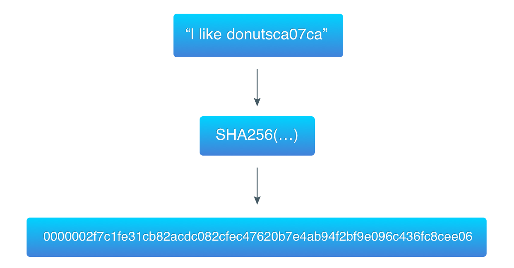

# **lab2 区块链共识协议**
***

## **姓名：** 陈奕衡

## **学号：** PB20000024

## **实验目的以及要求**

- 实现区块链上的POW证明算法
- 理解区块链上的难度调整的作用
- proofofwork.go
  - Run()  pow计算部分
  - Validate()  pow结果的验证工作
- 完成比较targetBits的修改带来的计算次数上的变化情况，从5-15的变化

## **实验平台**

- Windows 10 professional
- GoLand 
	- go version: go1.17.8.windows-amd64

## **实验原理**

### 区块链共识协议

- 区块链共识的关键思想就是为了结点通过一些复杂的计算操作来获取写入区块的权利。这样的复杂工作量是为了保证区块链的安全性和一致性。如果是对应比特币、以太坊等公有链的架构，对于写入的区块会得到相应的奖励（俗称挖矿）。
- 根据[比特币的白皮书](https://bitcoin.org/bitcoin.pdf),共识部分是为了决定谁可以写入区块的问题，区块链的决定是通过最长链来表示的，这个是因为最长的区块对应有最大的工作量投入在其中。
- 相应地，为了保证区块链的出块保持在一个相对比较稳定的值，对应地，对进行区块链共识难度的调整来保证出块速度大致保持一致。对应比特币来说，写入区块的节点还对应会获得奖励。

### 工作量证明（POW）

- 工作量的证明机制，简单来说就是通过提交一个容易检测，但是难以计算的结果，来证明节点做过一定量的工作。对应的算法需要有两个特点：   
  - 计算是一件复杂的事情
  - 但是证明结果的正确与否是相对简单的。

- 在区块链中，工作量证明就是去寻找一个满足必要条件的哈希值。在寻找哈希值的过程中，POW要求发起者进行一定量的运算，消耗计算机一定的时间。

### 区块链哈希

- 区块链上哈希函数的一些基本特点：
  1. 原始数据不能直接通过哈希值来还原，哈希值是没法解密的。
  2. 特定数据有唯一确定的哈希值，并且这个哈希值很难出现两个输入对应相同哈希输出的情况。
  3. 修改输入数据一比特的数据，会导致结果完全不同。
  4. 没有除了穷举以外的办法来确定哈希值的范围。

- 本次实验依旧采用SHA256算法获取哈希值

- 比特币采用了[哈希现金(hashcash)](https://en.wikipedia.org/wiki/Hashcash)的工作量证明机制，对应流程如下：

  1. 本次实验我们需要首先构建当前区块头，区块头包含**上⼀个区块哈希值(32位)，当前区块数据对应哈希（32位，即区块数据的merkle根），时间戳，区块难度，计数器(nonce)**。通过计算当前区块头的哈希值来求解难题
  2. 添加计数器作为随机数。计算器从0开始基础，每个回合 **+1**
  3. 对于上述的数据来进行一个哈希的操作
  4. 判断结果是否满足计算的条件：
     1. 如果符合，则得到了满足结果
     2. 如果没有符合，从2开始重新直接2、3、4步骤

 - 从中也可以看出，这是一个"非常暴力"的算法。这也是为什么这个算法需要指数级的时间。这里举一个简单的例子，对应数据为`I like donuts`，`ca07ca`是对应的前一个区块哈希值

 

### 难度控制

在本次实验中，我们选用了一个初始难度值为5来进行计算。这意味着我们需要获取一个**1<<(256-targetBits)**小的数，这里为**1<<(256-5)**。**在本实验中，为了模拟出块的难度值调整，每出一个块，对应targetBits难度增加1。**（在代码测试时，可以修改Block.NewBlock，来保持困难度不改变）

```go
targetBits = 5 //难度值
```

### POW结构

```go
// ProofOfWork represents a proof-of-work
type ProofOfWork struct {
	block  *Block
	target *big.Int
}

// NewProofOfWork builds and returns a ProofOfWork
func NewProofOfWork(b *Block) *ProofOfWork {
	target := big.NewInt(1)
	target.Lsh(target, uint(256-targetBits))

	pow := &ProofOfWork{b, target}

	return pow

}
```

 - `ProofOfWork`是一个区块的指针,对应我们在区块中记录加上了**Bits**，记录当前区块计算的难度。 为了进行区块上的操作，我们需要使用`big.Int`来得到一个大数操作，对应难度就是之前提到的`1 << (256-targetBits)`。

 - 在这个实验中，我们还需要注意到的是`第一个区块对应的hash`是一个为空的值。

 - 动态控制则体现在Block.NewBlock中：

```go
// NewBlock creates and returns Block
func NewBlock(datas []string, prevBlockHash []byte) *Block {
	blockData := [][]byte{}
	for _, data := range datas {
		blockData = append(blockData, []byte(data))
	}

	block := &Block{time.Now().Unix(), blockData, prevBlockHash, []byte{}, targetBits, 0}
	targetBits += 1

	pow := NewProofOfWork(block)
	nonce, hash := pow.Run()

	block.Hash = hash[:]
	block.Nonce = nonce

	return block
}
```

 - 对于*int*转*byte*的操作可以使用`utils.go`里的`IntToHex`函数来实现：

```go
// IntToHex converts an int64 to a byte array
func IntToHex(num int64) []byte {
	buff := new(bytes.Buffer)
	err := binary.Write(buff, binary.BigEndian, num)
	if err != nil {
		log.Panic(err)
	}

	return buff.Bytes()
}
```

## **实验步骤**
***

### 获取区块头

这里区块头的定义如下：

```go
block_head := bytes.Join([][]byte{
	pow.block.PrevBlockHash,
	pow.block.HashData(),
	IntToHex(pow.block.Timestamp),
	IntToHex(int64(targetBits)),
	IntToHex(int64(pow.block.Nonce)),
}, []byte{})
```

这里区块头的构造顺序是：上一个区块哈希（32位），当前区块哈希（32位），时间戳，区块难度，随机数生成器。最终存储在一个`Byte`切片中

### 工作量证明

通过一个for循环进行哈希值的运算：

```go
for nonce < maxNonce {
	blockHead := bytes.Join([][]byte{
		pow.block.PrevBlockHash,
		pow.block.HashData(),
		IntToHex(pow.block.Timestamp),
		IntToHex(int64(targetBits)),
		IntToHex(int64(nonce)),
	}, []byte{})

	hash = mySha256(blockHead)

	hashInt.SetBytes(hash[:])

	if hashInt.Cmp(pow.target) == -1 {
		break
	} else {
		nonce++
	}
}
```

这里通过maxNonce限制随机数溢出，随机数按顺序生成。

```go
var ( maxNonce = math.MaxInt64 )
```

for循环中的操作主要有：
 - 利用sha256算法得出切片的哈希
 - 将算出的哈希值转化为`big.int`类型
 - 与`target`进行比较判断哈希值是否大于大整数值

### 哈希值验证 

哈希值的验证函数即为对切片哈希值与大`target`进行比较

```go
var hashInt big.Int

block_head := bytes.Join([][]byte{
	pow.block.PrevBlockHash,
	pow.block.HashData(),
	IntToHex(pow.block.Timestamp),
	IntToHex(int64(targetBits)),
	IntToHex(int64(pow.block.Nonce)),
}, []byte{})

hash := mySha256(block_head)

hashInt.SetBytes(hash[:])

if hashInt.Cmp(pow.target) == -1 {
	return true
} else {
	return false
}
```

### 结果比较

结果比较的实现，是在`printchain`时，添加显示：

```go
fmt.Printf("Nonce: %d\n", block.Nonce)
fmt.Printf("TargetBits: %d\n", block.Bits)
``` 

## 实验结果

创建一个新的区块链后，创建一个新的区块，可以看到相应的哈希值、计数器和难度：

 

并且在这里可以看到根据难度生成的hash值和POW验证计算正确

之后调整难度生成相同区块：（这里挑选了几个区块显示）

 
 
  
  
   
  

可以看出伴随着区块难度的提升，相应的工作量（计算次数）也在上升，但不失有特殊情况：
  

说明此种工作量证明方法仍具有一定的偶然性

## **实验总结**

本次实验中，我理解了有关工作量证明方面的知识，在此基础上实现了自己的、简单的工作量证明机制，虽具有一定的偶然性，但也能够较直观的体现出难度对于工作量的影响。收获巨大。