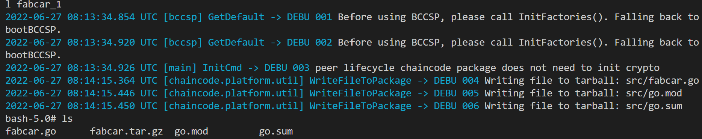

# **实验4 Fabric 开发并部署链码**
***

## **姓名：** 陈奕衡

## **学号：** PB20000024

## **实验目的以及要求**

- 了解fabric上的链码部署和配置
- 开发fabric上的链码
- 实现一个fabric上的链码和功能

## **实验平台**

- Windows 10 professional
- ubuntu虚拟机（ssh远程连接，配备有注册好的ca服务器）


## **实验步骤**
***

### c档

#### 链码打包

首先是链码打包，进入bash，执行如下指令：

```bash
peer lifecycle chaincode package fabcar.tar.gz \
>  --path go/src/etc/hyperledger/org1/go --lang golang --label fabcar_1
```

上述路径为本地提前挂载好的路径

看到如下信息表示打包完成：

 

#### 链码安装

打包完成之后执行如下指令，进行链码安装：

```bash
//使用admin的证书来进行链码安装操作
export CORE_PEER_MSPCONFIGPATH=/etc/hyperledger/org1/admin/msp
//安装链码
peer lifecycle chaincode install fabcar.tar.gz
//查询安装的链码
peer lifecycle chaincode queryinstalled
 ```

安装完成后提示如下信息，显示链码已经上链

 
 
#### 链码准入

安装完成后执行如下指令，即可实现链码准入。

```bash
export CORE_PEER_MSPCONFIGPATH=/etc/hyperledger/org1/admin/msp
peer lifecycle chaincode queryinstalled

export VERSION=60
export PACKAGE_ID=fabcar_1:7b0ab52f7dd7a3b34d7f9a3461897f70accd0f9b8d604e6a4518e72ee2e86c55
// tls证书
export ORDERER_CA=/etc/hyperledger/org1/peer2/tls-msp/tlscacerts/tls-172-16-4-35-7052.pem
export CHANNEL_NAME=mychannel

peer lifecycle chaincode approveformyorg -o orderer1-org0:7050 --ordererTLSHostnameOverride orderer1-org0 --tls --cafile ${ORDERER_CA} --channelID ${CHANNEL_NAME} --name fabcar --version ${VERSION} --package-id ${PACKAGE_ID} --sequence ${VERSION}
```

其中version要注意比现有链的数量要大

准入成功后得出以下提示：

 

#### 链码上链

利用如下指令进行链码上链操作

```bash
peer lifecycle chaincode commit -o orderer1-org0:7050 --ordererTLSHostnameOverride orderer1-org0 --tls --cafile $ORDERER_CA --channelID $CHANNEL_NAME --name fabcar --peerAddresses PB20000024_v2:7051 --tlsRootCertFiles ${ORDERER_CA}  --version ${VERSION} --sequence ${VERSION}
```

环境变量同上，但是顺序要按照块数量进行指定

上链成功之后得到以下提示：

 

之后运行

```bash
peer lifecycle chaincode querycommitted --channelID mychannel --name fabcar
```

  

可以看到提交已经成功

再运行

```bash
peer chaincode invoke -o orderer1-org0:7050 --ordererTLSHostnameOverride orderer1-org0 --tls --cafile $ORDERER_CA -C $CHANNEL_NAME -n fabcar --peerAddresses peer1-org1:7051 --tlsRootCertFiles ${ORDERER_CA}  -c '{"function":"initLedger","Args":[]}'
```

能够看到已经成功初始化

  

### B档

#### 添加新节点

源码如下：

```go
// CreateCar adds a new car to the world state with given details
func (s *SmartContract) CreateCar(ctx contractapi.TransactionContextInterface, carNumber string, make string, model string, colour string, owner string) error {
        car := Car{
                Make:   make,
                Model:  model,
                Colour: colour,
                Owner:  owner,
        }

        carAsBytes, _ := json.Marshal(car)

        return ctx.GetStub().PutState(carNumber, carAsBytes)
}
```

执行如下指令：

 

得到如下结果：

 

说明添加成功

#### 查询节点

源码如下：

```go
func (s *SmartContract) QueryCar(ctx contractapi.TransactionContextInterface, carNumber string) (*Car, error) {
	carAsBytes, err := ctx.GetStub().GetState(carNumber)

	if err != nil {
		return nil, fmt.Errorf("Failed to read from world state. %s", err.Error())
	}

	if carAsBytes == nil {
		return nil, fmt.Errorf("%s does not exist", carNumber)
	}

	car := new(Car)
	_ = json.Unmarshal(carAsBytes, car)

	return car, nil
}
```

执行如下指令：

 

得到查询结果

 

#### 删除节点

源码如下：

```go
func (s *SmartContract) DeleteCar(ctx contractapi.TransactionContextInterface, carNumber string) (*Car, error) {
	carAsBytes, err := ctx.GetStub().GetState(carNumber)

	if err != nil {
		return nil, fmt.Errorf("Failed to read from world state. %s", err.Error())
	}

	if carAsBytes == nil {
		return nil, fmt.Errorf("%s does not exist", carNumber)
	}

	return nil, ctx.GetStub().DelState(carNumber)

}
```

执行如下指令：

 

之后再查询资产，可以看到：

 

资产已经成功被删除

#### 修改节点

源码如下：

```go
func (s *SmartContract) ChangeCar(ctx contractapi.TransactionContextInterface, carNumber string, make string, model string, colour string, owner string) error {
	car, err := s.QueryCar(ctx, carNumber)

	if err != nil {
		return nil
	}

	car.Make = make
	car.Owner = owner
	car.Colour = colour
	car.Model = model

	carAsBytes, _ := json.Marshal(car)

	return ctx.GetStub().PutState(carNumber, carAsBytes)
}
```

执行如下指令：

 

之后查询资产，可以发现修改已经产生：

 

B档所有操作已经完毕

### A档

这里添加的额外指令是sort排序指令

源码如下：

```go
func (s res) Len() int {
	return len(s)
}
func (s res) Swap(i, j int) {
	s[i], s[j] = s[j], s[i]
}
func (s res) Less(i, j int) bool {
	return strings.Compare(s[i].Record.Owner, s[j].Record.Owner) == 1
}

func (s *SmartContract) SortCar(ctx contractapi.TransactionContextInterface) ([]*QueryResult, error) {
	startKey := ""
	endKey := ""

	resultsIterator, err := ctx.GetStub().GetStateByRange(startKey, endKey)

	if err != nil {
		return nil, nil
	}
	defer resultsIterator.Close()

	results := []*QueryResult{}

	for resultsIterator.HasNext() {
		queryResponse, err := resultsIterator.Next()

		if err != nil {
			return nil, nil
		}

		car := new(Car)
		_ = json.Unmarshal(queryResponse.Value, car)

		queryResult := QueryResult{Key: queryResponse.Key, Record: car}
		results = append(results, &queryResult)
	}
	sort.Sort(res(results))

	return results, nil
}
```

执行如下指令：

 

可以看到降序排列的交易列表：

 

排列成功

## 实验总结

本实验中，我学习到了简单的链码配置以及链码的修改，进一步理解了超级账本和链码的功能，并且也学习到了很多远程操作的办法，收获颇丰。