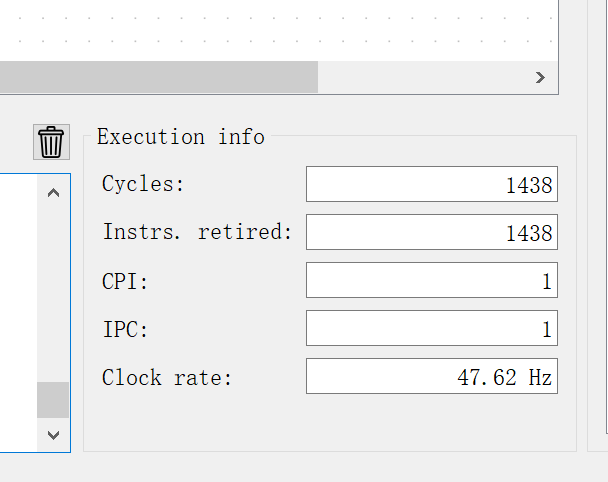

# 计算机组成原理 实验报告
***

### 姓名：陈奕衡

### 学号：PB20000024

## 一、实验题目

- RISC-V实现冒泡排序

## 二、实验平台

- ripes软件

## 三、实验过程

### 实现思路

首先，使用高级语言（c）勾勒出整个程序中排序部分的大体框架，如下图所示：

```c
void BubSort_test() {
    for (int i = 0; i < N; i++) {
        for (int j = 0; j + 1 < N - i; j++) {
            if (a[j] > a[j + 1]) {
                swap(&a[j], &a[j + 1]);
            }
        }
        printf("第%d轮冒泡排序：", i + 1);
        for (int i = 0; i < N; i++) {
            printf("%d ", a[i]);
        }
        printf("\n");
    }
}
```

之后分析程序框架，由四个主要部分构成，分别是两层for循环结构，内部的swap函数以及输出。那么思路就很明确了，就是分别还原四个部分，下图为四部分结构的还原：

- for循环结构：


主要实现三个功能即可：初始化参数，每次循环开始前条件判断，每轮循环结束时的参数自增。寄存器分配如下：x21寄存器存储n - i，x10存储数组v的地址，而x11存储数组大小，x19、x20则分别存储内外循环参数i，j。

- swap函数：


该部分借用了x5、x6两个临时寄存器来实现对于v[j]的地址以及内容获取，利用x7寄存器进行数据交换。

- 输出数组：


这里是在例程中对按照范围输出整数的基础上进行修改（矩形框图标出），实现对于数组的输出。到此为止，整个程序已经结束。

- 在完成以上部分之后，意识到还应该为所使用的寄存器进行保存与恢复，否则有可能在其他调用过程中导致寄存器中的值混乱，因此整个函数的过程头与过程尾如下：


### 数据段映像


数据段分为两个部分：数组部分以及输出部分。数组部分存储了每个数组元素和数组大小，输出部分则存储了字符`，`和`\n`以方便输出。

### console输出展示以及计时


可以看到排序之前的原始数组以及经过冒泡排序后降序排列的数组。其中前两个元素取自学号的首两位和尾两位（20，24）。



上图为执行整个程序所用的cycle数，调整时钟周期为10ms开始计时，整个程序运算完成需43.52s。

### 典型问题以及解决过程

该程序中存在参数传递问题，因为sort过程中需要v[0]的地址以及数组大小n，但是swap过程需要将其参数放在相同的寄存器中。解决方案是启用x22和x23寄存器专门储存v[0]和n，从而使得在swap过程中可用。


## 四、完整代码

```riscv
.data
array:	.word 20,24,26,46,78,33,21,1,83,17,4,56,15
number:		.word 12
delimiter: 	.string ", "
newline: 	.string "\n"

.text
print1:
la a0, array # print array[0] to array[number]
lw a1, number
slli a1, a1, 2
add a1, a1, a0
li a2, 1
jal loopPrint

jal printNewline

la x10, array # get the array[0] address
lw x11, number # get the number n
sort:
addi sp, sp, -24
sw x1, 20(sp)
sw x23, 16(sp)
sw x22, 12(sp)
sw x21, 8(sp)
sw x20, 4(sp)
sw x19, 0(sp)
mv x22, x10
mv x23, x11
li x19, 0 # int i = 0
for1tst:
addi x21, x11, -1
bge x19, x21, exit1  # if(i >= n - 1) exit
li x20, 0 # int j = 0
for2tst:
sub x21, x11, x19    # n - i
bge x20, x21, exit2   # if(j >= n - i) exit
iftst:
slli x5, x20, 2 # j * 4
add x5, x10, x5 # j * 4 + v
lw x6, 0(x5) 		# x6 = v[j]
lw x7, 4(x5) 		# x7 = v[j + 1]
bge x6, x7, exitif 	# if( v[j] >= v[j + 1]) exit
mv x10, x22		# get v
mv x11, x23		# get n
jal x1, swap
exitif:
addi x20, x20, 1 # j++
j for2tst
exit2:
addi x19, x19, 1  # i++
j for1tst
exit1:
lw x1, 20(sp)
lw x23, 16(sp)
lw x22, 12(sp)
lw x21, 8(sp)
lw x20, 4(sp)
lw x19, 0(sp)
addi sp, sp, 24
print2:
la a0, array
lw a1, number
slli a1, a1, 2
add a1, a1, a0
li a2, 1
jal loopPrint

jal printNewline
jr x1
swap:
slli x6, x20, 2
add x6, x10, x6
lw x5, 0(x6)
lw x7, 4(x6)
sw x7, 0(x6)
sw x5, 4(x6)
jr x1

loopPrint:
addi t0, a0 0
addi t1, a1 0
loop:
# Print value in a0 as specified by argument a2
addi a0, t0, 0
lw a0, 0(a0)
addi a7, a2, 0
ecall
# Print a delimiter between the numbers
li a7, 4
la a0, delimiter
ecall
# Increment
addi t0, t0, 4
ble t0, t1, loop
jr x1
printNewline:
la a0, newline
li a7, 4
ecall
jr x1
```