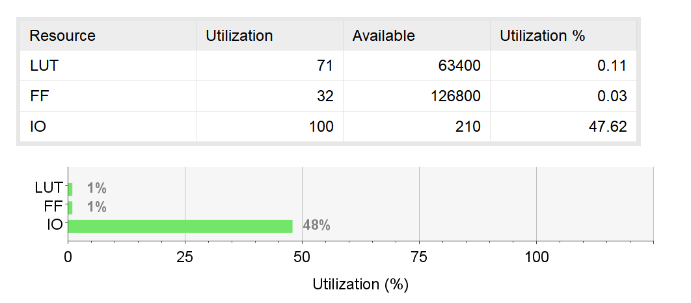

# 计算机组成原理 实验报告
***

### 姓名：陈奕衡

### 学号：PB20000024

## 一、实验题目

- 实验一  运算器及其应用

## 二、实验目的

-  掌握算术逻辑单元 (ALU) 的功能
- 掌握数据通路和控制器的设计方法
- 掌握组合电路和时序电路，以及参数化和结构化的Verilog描述方法
- 了解查看电路性能和资源使用情况

## 三、实验平台

- ISE / Vivado（暂不支持其他Verilog HDL开发环境的检查）
- fpgaol 平台

## 四、实验过程

### 32位alu模块的设计及电路查看

使用vivado程序进行32位ALU模块设计，根据ppt所给出的端口以及之前的verilog语言复习，做出如下设计：

```verilog
module tb_32();
reg [31:0] a, b;
reg [2:0] f;
wire [31:0] y;
wire z;

initial begin
        a = 0; b = 0; f = 0; 
    #20 a = 4'b1001; b = 4'b0110; f = 3'b000;
    #20 a = 4'b1001; b = 4'b0110; f = 3'b001;
    #20 a = 4'b1001; b = 4'b0110; f = 3'b010;
    #20 a = 4'b1001; b = 4'b0110; f = 3'b011;
    #20 a = 4'b1001; b = 4'b0110; f = 3'b100;
    #20 a = 4'b1001; b = 4'b0110; f = 3'b101;
    #20 a = 4'b1001; b = 4'b0110; f = 3'b110;
    #20 a = 4'b1001; b = 4'b0110; f = 3'b111;
end

alu32 sed(.a(a), .b(b), .f(f), .y(y), .z(z));

endmodule
```

根据设计进行RTL电路生成，得到如下电路：


根据设计进行综合电路生成，得到如下电路：


之后查看资源使用状况，如下图：



ALU的线网延迟和总延迟如下：


### 6位ALU的设计及电路查看

根据ppt上的电路图，作出如下分时复用端口的设计：


首先是红框中画出的部分，即译码器部分：

```verilog
always @(posedge clk) begin
    if (en) begin
        case (sel)
            2'b00: a <= x;
            2'b01: b <= x;
            2'b10: f <= x[2:0]; 
        endcase
    end
end
```

之后为译码后执行运算的ALU模块：

```verilog
always @(a, b, f) begin
    casez(f [2:0])
        3'b000: y_reg = a + b;
        3'b001: y_reg = a - b;
        3'b010: y_reg = a & b;
        3'b011: y_reg = a | b;
        3'b100: y_reg = a ^ b;
        default: y_reg = 0;
    endcase
    z_reg = (y_reg) ? 0 : 1;
end

assign z = z_reg;
assign y = y_reg;
```

根据设计进行RTL电路生成，得到如下总电路：


之后查看资源使用状况，如下图：


ALU的时间性能报告如下：


### ALU应用：计算斐波那契—卢卡斯数列（FLS）

首先是设计出有限状态机（FSM）的状态图，如下：


- S0为初始状态和重置状态，负责使寄存器置0
- S1为输入状态，负责接收$f_1$
- S2也为输入状态，负责接收$f_2$
- S3为运算阶段，负责计算$f_n = f_{n - 1} + f_{n - 2}$
- S4为更新阶段，负责更新$f_{n - 1}$和$f_{n - 2}$

可以看出rst为同步复位，en_edge推进状态变换

之后在vivido中写出代码，以三段式呈现：

- 用时序逻辑模块描述当前状态：

```verilog
always @(posedge clk) begin			
    if (rst) begin   
        cs <= S0;  	        //同步复位
    end
    else begin
       cs <= ns;      // 描述NS
    end
end
```

- 组合逻辑模块描述状态转换：

```verilog
always @(*) begin 
    ns = cs;	     //默认赋值
    if (en_edge) begin
        case (cs)           
            S0: ns = S1;     
            S1: ns = S2;
            S2: ns = S3;
            S3: ns = S4;
            S4: ns = S3;         
            default: ns = S0;
	    endcase   
    end
end
```

- 时序逻辑模块描述相应状态中执行的操作：

```verilog
always @(posedge clk) begin
    if(rst) begin
        fn <= 0; fnnn <= 0; fnn <= 0;
    end
    if(en_edge) begin
        case(cs)
            S0: begin
                fn <= 0; fnnn <= 0; fnn <= 0;
            end
            S1: begin
                fn <= d; fnnn <= d;
            end
            S2: begin
                fnn <= d; fnnn <= d;
            end
            S3: begin
                fnnn <= fn + fnn;
            end
            S4: begin
                fn = fnn; fnn = fnnn;
            end
        endcase
    end
end
```

这里发现S4状态下若使用非阻塞赋值会导致fn的赋值错误，因此此处两个赋值语句使用阻塞赋值。

- 最后是描述输出的部分：

```verilog
assign f = fnnn;
```

此后测试发现en不取边沿会导致因使用者的按键问题而造成状态跳转错误

- 下面是取时钟边沿的模块：

```verilog
module edge1(
    input clk,
    input button,
    output button_edge
);

reg button_r1, button_r2;

always @ (posedge clk) begin
    button_r1 <= button;
end
always @ (posedge clk) begin
    button_r2 <= button_r1;
end

assign button_edge = button_r1 & (~button_r2);

endmodule
```

## 五、实验结果

### 32位ALU模块仿真

仿真文件如下：

```verilog
module tb_32();
reg [31:0] a, b;
reg [2:0] f;
wire [31:0] y;
wire z;

initial begin
        a = 0; b = 0; f = 0; 
    #20 a = 4'b1001; b = 4'b0110; f = 3'b000;
    #20 a = 4'b1001; b = 4'b0110; f = 3'b001;
    #20 a = 4'b1001; b = 4'b0110; f = 3'b010;
    #20 a = 4'b1001; b = 4'b0110; f = 3'b011;
    #20 a = 4'b1001; b = 4'b0110; f = 3'b100;
    #20 a = 4'b1001; b = 4'b0110; f = 3'b101;
    #20 a = 4'b1001; b = 4'b0110; f = 3'b110;
    #20 a = 4'b1001; b = 4'b0110; f = 3'b111;
end

alu32 sed(.a(a), .b(b), .f(f), .y(y), .z(z));

endmodule
```

ALU功能表如下：


仿真波形如下：


### 6位ALU模块仿真以及下载测试

仿真文件如下：

```verilog
module tb_alu();
reg clk, en;
reg [1:0] sel;
reg [5:0] x; 

wire z;
wire [5:0] y;	

initial begin
        x = 0; sel = 0; en = 0; 
    #20 x = 4'b1010; sel = 2'b00; en = 1'b1;
    #20 x = 4'b0110; sel = 2'b01; en = 1'b1;
    #20 x = 4'b0000; sel = 2'b10; en = 1'b1;
    #20 x = 4'b0001; sel = 2'b10; en = 1'b1;
    #20 x = 4'b0010; sel = 2'b10; en = 1'b1;
    #20 x = 4'b0011; sel = 2'b10; en = 1'b1;
    #20 x = 4'b0100; sel = 2'b10; en = 1'b1;
    #20 x = 4'b0101; sel = 2'b10; en = 1'b1;
end

initial begin
    clk = 1'b0;
    forever
        #5 clk = ~clk;
end

alu6 ads(.clk(clk), .en(en), .sel(sel), .x(x), .y(y), .z(z));

endmodule
```

译码器真值表如下：


仿真波形如下：


ALU模块外设端口分配：


下载bit流测试结果：

- 为a进行赋值：


- 为b进行赋值：


- 计算$a + b$：


- 计算$a - b$：


- 计算$a \& b$：


- 计算$a | b$：


- 计算$a ⊕ b$：


- 异常状态不取值：


### FLS仿真测试与下载测试

仿真文件如下：

```verilog
module tb_fls();
reg clk, rst, en, en_edge;
reg [6:0] d; 
wire [6:0] f;

initial begin 
    clk = 1'b0;
    forever
        #5 clk = ~clk;
end

initial begin 
    en = 1'b0;
    #10 en = 1'b1;
    #10 en = 1'b0;
    #10 en = 1'b1;
    forever
        #100 en = ~en;
end

initial begin
    #5 rst = 1'b1;
    #100 d = 4'b0001; rst = 1'b0;
    #250 d = 4'b0001;
    #100 d = 4'b0010;
end
 
fls ddd(
    .clk(clk),
    .rst(rst),
    .en(en), 
    .d(d),
    .f(f)
);

endmodule
```

得到的仿真波形如下：


其中状态转换在每一次`en`上升沿进行，`fn`代表$f_{n - 2}$，`fnn`代表$f_{n - 1}$，`fnnn`代表$f_{n}$，`cs`代表现在的状态。

FLS模块外设端口分配：


下载bit流测试结果：

- 为fn赋值1：


- 为fnn赋值2：


- 开始fnnn的计算：


- rst重新置位：


## 六、心得体会：

作为本学期第一次实验，个人感觉十分恰当！复习了verilog的语言知识和FPGA平台的运用，并在此基础上，实现了基本的alu模块，收获匪浅。