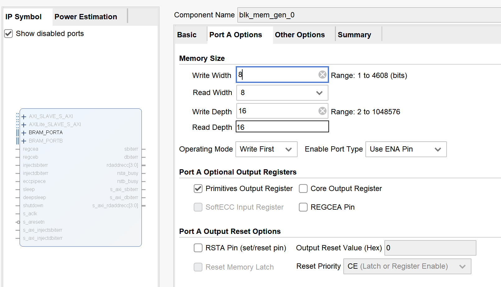
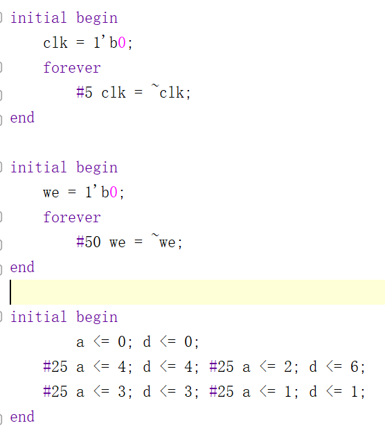
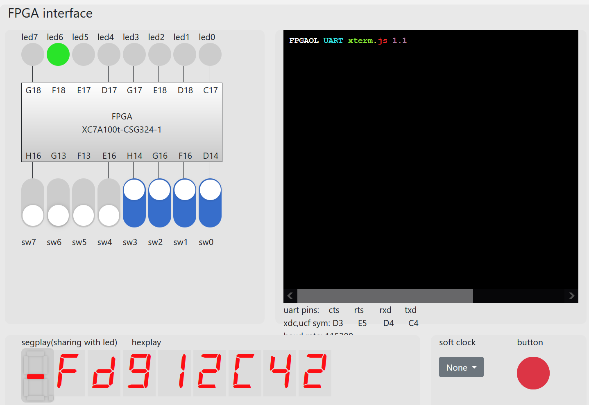

# 计算机组成原理 实验报告
***

### 姓名：陈奕衡

### 学号：PB20000024

## 一、实验题目

- 实验二 寄存器堆与存储器及其应用

## 二、实验目的

- 掌握寄存器堆（Register File）和存储器的功能、时序及其应用
- 熟练掌握数据通路和控制器的设计和描述方法

## 三、实验平台

- ISE / Vivado（暂不支持其他Verilog HDL开发环境的检查）
- fpgaol 平台

## 四、实验过程

### 寄存器堆

根据PPT上所给出的端口，以行为描述32*32位大小的三端口寄存器堆：

```verilog
module rge #(parameter WIDTH = 32)(
    input clk, we,
    input [4:0] ra0, ra1, wa,
    input [WIDTH - 1:0] wd,
    output [WIDTH - 1:0] rd0, rd1 
);

reg [WIDTH - 1:0] regfile [0:32];

assign rd0 = regfile[ra0],
       rd1 = regfile[ra1];

always @(posedge clk) begin
    if(we && wa) begin
            regfile[wa] <= wd;
    end
end

endmodule
```

可见该寄存器堆可支持双端口异步读取，单端口同步写入。为方便后续进行cpu寄存器堆的例化，补充x0寄存器置0过程。

```verilog
module rge #(parameter WIDTH = 32)(
    input clk, we,
    input [4:0] ra0, ra1, wa,
    input [WIDTH - 1:0] wd,
    output [WIDTH - 1:0] rd0, rd1 
);

reg [WIDTH - 1:0] regfile [0:32];

assign rd0 = regfile[ra0],
       rd1 = regfile[ra1];

always @(posedge clk) begin
    regfile[0] = 32'h00000000;
    if(we && wa) begin
            regfile[wa] <= wd;
    end
end

endmodule
```

### RAM存储器

分布式存储器IP

- 定义如下$16 * 8$的分布式存储器ip核：


并赋予如下的初始化coe文件：


- 定义如下$16 * 8$的块式存储器ip核：



其中初始化coe文件与分步式存储器一致，选取写优先模式，从生成时可以看出，块式存储器比分布式存储器多一个总使能，可以完成更细致的读写规划。


### 利用寄存器堆实现FIFO队列

根据PPT所述要求以及端口序列，得出如下FIFO序列状态图：


- IDLE：队列处于等待状态，在enq（deq）信号到达时进行入队（出队）操作
- PROUT：用于出队前对于出队数据的显示，因此之后无条件跳转至DEQU状态
- DEQU：出队操作，在完成之后直接返回等待状态
- ENQU：入队操作，在完成之后直接返回等待状态

之后根据PPT中所给的基本参数定义所需使用的寄存器：


```verilog
reg [15:0] cnt;
reg [1:0] cs, ns;
reg [2:0] head, tail, wa, prt, an_reg, choice;
reg [3:0] wd, out_reg, seg_reg;
reg full_reg, empty_reg, we, temp;
reg [7:0] valid;
wire [3:0] out1, rd0;
```

其中`cnt`、`choice`、`prt`用于之后的时分复用的晶体管输出，`cs`、`ns`用于状态变化，`temp`用于在一次出（入）队中保证不重复操作。

之后介绍三段式模块设计，用时序逻辑模块描述当前状态：

```verilog
always @(posedge clk) begin			
    if (rst) begin   
        cs <= IDLE;  	        //同步复位
    end
    else begin
        cs <= ns;      // 描述NS
    end
end
```

组合逻辑模块描述状态转换：

```verilog
always @(*) begin 
    ns = cs;	     //默认赋值
    case (cs)           
        IDLE: begin
            if (!full && enq && !deq) 
                ns = ENQU;
            else if(!empty && deq && !enq) 
                ns = PROUT;
        end 
        DEQU: begin
            if (deq) ns = DEQU;
            else ns = IDLE;           
        end
        ENQU: begin
            if (enq) ns = ENQU;
            else ns = IDLE; 
        end
        PROUT: ns = DEQU;  
        default: ns = IDLE; 
	endcase   
end
```

时序逻辑模块描述相应状态中执行的操作：

- 等待操作：

```verilog
IDLE: 
    begin
        head <= head; tail <= tail; out_reg <= 0;
        valid <= valid; we <= 0; temp <= 0;
        if (valid == 8'hff) begin
            full_reg <= 1;
        end else if (valid == 8'h00) begin
            empty_reg <= 1;            
        end else begin
            full_reg <= 0;
            empty_reg <= 0;
        end
    end
```

- 入队操作：

```verilog
ENQU: 
    begin
        if (!temp) begin
            we <= 1;
            valid[head] <= 1;
            wa = head;
            head = head + 1;
            wd <= in;               
            temp <= 1;
        end
    end
```

- 出队操作：

```verilog
DEQU: 
    begin
        if (!temp) begin
            we <= 1;
            valid[tail] <= 0;
            wa = tail;
            tail = tail + 1;
            wd = 0;
            temp <= 1;
            out_reg <= out_reg;
        end
    end
```

三段式状态机描述结束。然后是输出部分，由于需要用到7段晶体数码管，因此需要采用时分复用的方法，而此时晶体管的闪烁频率不能过高，因此需要使用一个计时器达到降频的过程，cnt在输出模块中将clk频率降至10kHz。并且，通过valid值判断队列中有无数字存在，以决定是否进行显示。

```verilog
always @(posedge clk) begin
    if(rst) begin
        cnt <= 0; an_reg <= 0; prt <= 0;
        choice <= 0; seg_reg <= 0;
    end
    else if(cnt < 10) begin
        cnt <= cnt + 1;
    end else begin
        cnt <= 0; choice <= choice + 1;
        if(valid[choice]) begin
            case (choice)
                3'b000: begin
                    prt <= 3'b000;
                    an_reg <= 3'b000;
                end
                3'b001: begin
                    prt <= 3'b001;
                    an_reg <= 3'b001;
                end
                3'b010: begin
                    prt <= 3'b010;
                    an_reg <= 3'b010;
                end
                3'b011: begin
                    prt <= 3'b011;
                    an_reg <= 3'b011;
                end
                3'b100: begin
                    prt <= 3'b100;
                    an_reg <= 3'b100;
                end
                3'b101: begin
                    prt <= 3'b101;
                    an_reg <= 3'b101;
                end
                3'b110: begin
                    prt <= 3'b110;
                    an_reg <= 3'b110;
                end
                3'b111: begin
                    prt <= 3'b111;
                    an_reg <= 3'b111;
                end 
            endcase
        end
    end
    seg_reg <= rd0;
end
```

最后介绍与8*4寄存器的接口，在实验1的基础上添加rst使得寄存器中内容也可复位，ra0端口负责读出数据在7位数码管显示，ra1端口负责读出数据，出队时在led上显示，因此可以直接连接tail寄存器。

```verilog
rge8 sdg(
    .clk(clk), 
    .rst(rst),
    .we(we),
    .ra0(prt), 
    .ra1(tail),
    .wa(wa),
    .wd(wd),
    .rd0(rd0),
    .rd1(out1) 
);
```

## 五、实验结果

### 寄存器堆

寄存器堆的端口说明如下：


寄存器堆的仿真文件如下：

```verilog
module tb_rge( );
reg [4:0] wa, ra0, ra1;
reg [31:0] wd;
reg we, clk;
wire [31:0] rd0, rd1;

initial begin 
        we = 0; wa = 0; wd = 0; ra0 = 0; ra1 = 0;
    #20 we = 1; wa = 5'b00000; wd = 32'h34720; ra0 = 0; ra1 = 0;
    #20 we = 1; wa = 5'b00001; wd = 32'h3245; ra0 = 0; ra1 = 0;
    #20 we = 1; wa = 5'b11010; wd = 32'h2341; ra0 = 0; ra1 = 0;
    #20 we = 0; wa = 0; wd = 0; ra0 = 5'b00110; ra1 = 5'b11001;
    #20 we = 0; wa = 0; wd = 0; ra0 = 5'b11010; ra1 = 0;
end

initial begin
    clk = 0;
    forever
        #5 clk = ~clk;
end

rge set(
    .clk(clk),
    .we(we),
    .wa(wa),
    .wd(wd),
    .ra0(ra0),
    .ra1(ra1),
    .rd0(rd0),
    .rd1(rd1)
);
endmodule
```

仿真波形如下：


可以看出x0寄存器能够保持赋值为0，并且其他寄存器可以正常写入写出，没有给部分寄存器初始化，因此会呈现未知态。

### RAM存储器

分布式存储器（上）和块式存储器（下）IP仿真文件如下：




分布式存储器（上）和块式存储器（下）仿真波形如下：


比较两者区别：两者在写入模块上基本无差别，都是按照时序正常进行，但是读出模块上有所区别——可以看出，在使能处于高电平时，块式存储器才读出数据，而分布式存储器读出数据则是没有任何限制，直接根据a所提供的地址进行读出操作；并且，分布式存储器中的数据需经过一个时钟周期的更新才能在spo端口正确显示，而块式存储器会根据已设定的模式（上图为优先写入模式）进行读写操作，不会产生错误显示的问题。

下面是块式存储器三种不同状态的波形图：

- 优先写入模式：


- 优先读出模式：


- 无改变模式：


之后在调试中发现块式存储器存在2cycles的存储延迟，表现如下：（read first mode）


可以清楚地看出第一次读取地址4的内容0x44时存在读取延迟的情况。


### 利用寄存器堆实现FIFO队列

fifo队列的仿真文件如下：

- 使能信号模块：

```verilog
module tb_fifo( );

reg clk, rst, enq, deq; 
reg [3:0] in;	
wire [3:0] out, seg; 	
wire [2:0] an;

initial begin 
    clk = 1'b0;
    forever
        #5 clk = ~clk;
end

initial begin 
    enq = 1'b0;
    forever
        #400 enq = ~enq;
end

initial begin 
    deq = 1'b1;
    forever
        #400 deq = ~deq;
end
```

- 输入数据模块：

```verilog
initial begin
        rst = 1'b1;
    #10  rst = 1'b0; in = 4'b0110;
    #450 in = 4'b1100;
    #450 in = 4'b0101;
    #450 in = 4'b0100;
    #450 in = 4'b1111;
end
```

仿真波形如下：


下载测试结果：


入队操作，可以看到无元素位置不会输出



入队操作（此时已队满）


出队操作（可以看到out会显示出队元素）


再次入队，可以发现入队位置正确


reset操作，全部元素归零，empty置1

## 六、心得体会：
本次实验让我熟悉了寄存器的行为描述和基本的寄存器ip核使用，并且在此基础上，利用寄存器实现了简单的fifo队列，进一步理解了寄存器的读取、写入与时钟的关系。

本次实验设计量一般，任务难度适中，可以根据PPT顺利进行下去，并且有着不小的收获。