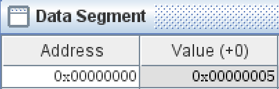

# 计算机组成原理 实验报告
***

### 姓名：陈奕衡

### 学号：PB20000024

## 一、实验题目

-  实验三 汇编程序设计

## 二、实验目的

- 熟悉RISC-V汇编指令的格式 
- 熟悉CPU仿真软件Ripes，理解汇编指令执行的基本原理（数据通路和控制器的协调工作过程）
- 熟悉汇编程序的基本结构，掌握简单汇编程序的设计
- 掌握汇编仿真软件RARS(RISC-V Assembler & Runtime Simulator)的使用方法，会用该软件进行汇编程序的仿真、调试以及生成CPU测试需要的指令和数据文件（COE）
- 理解CPU调试模块PDU的使用方法

## 三、实验平台

- PC 一台 
- Ripes： RISC-V graphical processor simulator
- Rars：RISC-V Assembler and Runtime Simulator 

## 四、实验过程

### 理解并仿真RIPES示例汇编程序

首先在ripes中打开console printing函数：

之后选择单周期cpu数据通路：

单步执行指令观察数据通路，下图为addi指令：

### Rars软件设计汇编程序，实现人工检查6条指令功能，并生成COE文件

根据ppt中的示例代码可以得到以下指令功能验证：

- sw指令：

- lw指令：

- addi指令：

- add指令：

- beq指令：

- jal 指令：

生成的coe文件如下：

### Rars软件设计汇编程序，实现计算斐波那契—卢卡斯数列（数列前两项为1，2），并生成COE文件

设计出的汇编文件如下：

生成的coe文件如下：

## 五、实验结果

### 理解并仿真RIPES示例汇编程序

标准输出程序运行结果如下：

### Rars软件设计汇编程序，实现人工检查6条指令功能，并生成COE文件

初始时led全亮，如下：

sw执行完，可以发现对应地址清零，成功将led全灭：

addi执行完， 可以发现对应地址赋值0xff，成功将所有led点亮：

lw执行完，可以看出led按照in中sw输入的值进行赋值：

add执行完，可以看出前四个led亮了起来：

beq会跳转至sign1位置，并让后四个led亮起来：

jal会跳转到sign2位置，并让中间四个led亮起来：

### Rars软件设计汇编程序，实现计算斐波那契—卢卡斯数列（数列前两项为1，2），并生成COE文件

该程序提取了.data端中所需数字n从而在a3数组中存储得到第$f_n$项的值

运行结果如下输出$f_5 = 8$

## 六、心得体会

本实验进一步让我熟悉了汇编语言的使用，并且做好了今后cpu调试的准备工作。本试验任务量一般，在课内实验使用ripes的基础上，我学会了rars软件的使用和生成coe文件，收获还是挺大的。