# 计算机组成原理 实验报告
***

### 姓名：陈奕衡

### 学号：PB20000024

## 一、实验题目

- 实验四  单周期CPU设计

## 二、实验目的

- 理解CPU的结构和工作原理
- 掌握单周期CPU的设计和调试方法
- 熟练掌握数据通路和控制器的设计和描述方法

## 三、实验平台

- ISE / Vivado（暂不支持其他Verilog HDL开发环境的检查）
- fpgaol 平台

## 四、实验过程

### 修改Lab2寄存器堆模块，增加1个用于调试的读端口，且使其r0内容恒定为0
修改后的寄存器堆文件如下：
``` verilog
module rge32 #(parameter WIDTH = 32)(
    input clk, rst, we,
    input [4:0] ra0, ra1, wa, m_rf_addr,
    input [WIDTH - 1:0] wd,
    output [WIDTH - 1:0] rd0, rd1, rf_data 
);

reg [WIDTH - 1:0] regfile [0:31];
integer i;

assign rd0 = regfile[ra0],
       rd1 = regfile[ra1],
       rf_data = regfile[m_rf_addr];

always @(posedge clk or posedge rst) begin
    regfile[0] = 32'h00000000;
    if(rst) begin
        for(i = 1; i < 32; i = i + 1)
            regfile[i] = 32'h00000000;
    end
    else if(we && wa) begin
        regfile[wa] <= wd;
    end
end

endmodule

```

此寄存器相比于Lab2，增加了如下内容：
- 对`x0`寄存器永远置零的功能（实验以及riscv要求），
- `rst`复位的功能（否则后面`alu`模块读取的`alu_a`将有可能为未知态，导致置零功能失效，从而影响`PCsrc`取值，进而停止`pc`自增）
- 多出一个读端口，是为了后续PDU模块和debug使用

***

### 结构化描述单周期CPU

本次实验基于如下数据通路进行：

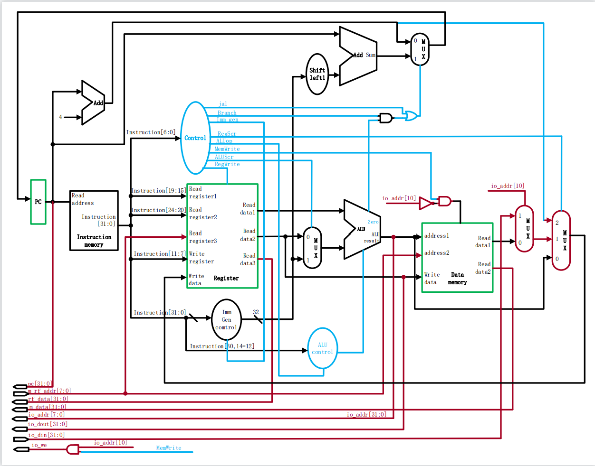

#### `alu`模块

该模块主要负责CPU中的各种加减逻辑运算，相比于实验一有所改进，代码如下：

``` verilog
module alu32 #(parameter WIDTH = 32)(//数据宽度
input   rst,
input  [WIDTH-1:0] a, b,	//两操作数（对于减运算，a是被减数）
input  [2:0] f,		//操作功能（加、减、与、或、异或等）
output  [WIDTH-1:0] y, 	//运算结果（和、差 …） 
output  z); 			//零标志（运算结果为零，z置1）

reg [WIDTH-1:0] temp;

always @(*) begin
    if(rst) begin
        temp = 0;
    end else begin
        case (f [2:0])
            3'b000: temp = a + b;
            3'b001: temp = a - b;
            3'b010: temp = a & b;
            3'b011: temp = a | b;
            3'b100: temp = a ^ b;
            3'b101: begin 
                if(a < b)
                    temp = 0;
                else 
                    temp = 1;
            end 
            default: temp = 0;
        endcase 
    end
end

assign z = (temp) ? 0 : 1;
assign y = temp;

endmodule    
```

 此`alu`模块相比于实验一，存在如下改进：
 - 添加了置位功能
 - 增加了`3'b101`的运算码，专门用来进行`blt`指令的判断

#### `imm_gen`模块

该模块负责生成相应指令的立即数，代码如下：

```verilog
module imm_gen(
    input rst,
    input [31:0] IR,
    output [31:0] imm
    );
 
reg [31:0] imm_reg;
    
always @(*) begin //imm_gen
    if(rst) begin
        imm_reg = 32'h00000000;
    end else begin
        case (IR[6:0])
            7'b0010111: begin //auipc
                imm_reg = {IR[31:12], 12'h000};
            end 
            7'b0010011: begin //i-type
                if(IR[31]) begin
                    imm_reg = {20'hfffff, IR[31:20]};
                end else begin
                    imm_reg = {20'h00000, IR[31:20]};
                end
            end
            7'b1100011: begin //beq
                if(IR[31]) begin
                    imm_reg = {19'hfffff, IR[31], IR[7], IR[30:25], IR[11:8], 1'b0};
                end else begin
                    imm_reg = {19'h00000, IR[31], IR[7], IR[30:25], IR[11:8], 1'b0};
                end
            end
            7'b0000011: begin //lw
                if(IR[31]) begin
                    imm_reg = {20'hfffff, IR[31:20]};                  
                end else begin
                    imm_reg = {20'h00000, IR[31:20]};
                end
            end
            7'b0100011: begin //sw
                if(IR[31]) begin
                    imm_reg = {20'hfffff, IR[31:25], IR[11:7]};
                end else begin
                    imm_reg = {20'h00000, IR[31:25], IR[11:7]};
                end            
            end
            7'b1101111: begin //jal
                if(IR[31]) begin
                    imm_reg = {11'hfff, IR[31], IR[19:12], IR[20], IR[30:21], 1'b0};
                end else begin
                    imm_reg = {11'h000, IR[31], IR[19:12], IR[20], IR[30:21], 1'b0};
                end 
            end
            7'b1100111: begin //jalr
                if(IR[31]) begin
                    imm_reg = {20'hfffff, IR[31:20]};                  
                end else begin
                    imm_reg = {20'h00000, IR[31:20]};
                end
            end
            default: begin
                imm_reg = 32'h00000000;
            end
        endcase
    end
end   

assign imm = imm_reg;

endmodule
```

该模块并无任何特殊该进，只需注意各立即数的在指令中的存储位置即可

#### `control` 模块

该模块主要负责对整个CPU模块输出控制信号进行控制，以实现CPU指令的正确实行，代码如下：

```verilog
module  control_unit (
    input [6:0] opcode, 
    input rst,

    //control signal
    output reg Branch,
    output reg ALUSrc,
    output reg MemWrite,
    output reg [1:0] MemtoReg, 
    output reg MemRead, 
    output reg RegWrite,
    output reg [1:0] ALUOp,
    output reg jump, 
    output reg jumpr
);

always @(*) begin
    if(rst) begin
        Branch = 0; ALUSrc = 0; MemWrite = 0; ALUOp = 2'b11;
        MemtoReg = 2'b00; MemRead = 0; RegWrite = 0; jump = 0; jumpr = 0;
    end else begin
        case (opcode)
            7'b0110011: begin//R-format
                Branch = 0; ALUSrc = 0; MemWrite = 0; ALUOp = 2'b10;
                MemtoReg = 2'b00; MemRead = 0; RegWrite = 1; jump = 0; jumpr = 0;
            end
            7'b1100011: begin//beq
                Branch = 1; ALUSrc = 0; MemWrite = 0; ALUOp = 2'b01;
                MemtoReg = 2'b00; MemRead = 0; RegWrite = 0; jump = 0; jumpr = 0;
            end
            7'b0010011: begin//i-format
                Branch = 0; ALUSrc = 1; MemWrite = 0;  ALUOp = 2'b11;
                MemtoReg = 2'b00; MemRead = 0; RegWrite = 1; jump = 0; jumpr = 0;
            end
            7'b0000011: begin//lw
                Branch = 0; ALUSrc = 1; MemWrite = 0;  ALUOp = 2'b00;
                MemtoReg = 2'b01; MemRead = 1; RegWrite = 1; jump = 0; jumpr = 0;
            end
            7'b0100011: begin//sw
                Branch = 0; ALUSrc = 1; MemWrite = 1;  ALUOp = 2'b00;
                MemtoReg = 2'b00; MemRead = 0; RegWrite = 0; jump = 0; jumpr = 0;
            end
            7'b1101111: begin//jal
                Branch = 0; ALUSrc = 1; MemWrite = 0;  ALUOp = 2'b00;
                MemtoReg = 2'b10; MemRead = 0; RegWrite = 1; jump = 1; jumpr = 0;
            end
            7'b1100111: begin//jalr
                Branch = 0; ALUSrc = 1; MemWrite = 0;  ALUOp = 2'b00;
                MemtoReg = 2'b10; MemRead = 0; RegWrite = 1; jump = 1; jumpr = 1;
            end
            7'b0010111: begin//auipc
                Branch = 0; ALUSrc = 0; MemWrite = 0;  ALUOp = 2'b00;
                MemtoReg = 2'b11; MemRead = 0; RegWrite = 1; jump = 0; jumpr = 0;
            end
            default: begin
                Branch = 0; ALUSrc = 0; MemWrite = 0;  ALUOp = 2'b11;
                MemtoReg = 2'b00; MemRead = 0; RegWrite = 0; jump = 0; jumpr = 0;
            end
        endcase
    end
end

endmodule
```

该模块相比于书中标准的数据通路，增加了如下部分：

- 添加`jump`、`jumpr`信号，用于`jal`、`jalr`指令执行时相关`npc`值的赋值
- 将`MemtoReg`信号拓宽为两位，其作用如下：
  | 位数 | 作用 | 
  | -----| ---- | 
  | 2'b00 | 同原数据通路1'b0情况，写回`alu`模块运算结果 | 
  | 2'b01 | 同原数据通路1'b1情况，写回`data_memory`模块读取数值 |
  | 2'b10 | 在jal和jalr指令中取到，写回当前`pc`值 |
  | 2'b11 | 在auipc指令中取到，写回相加后得到的`pc+imm` |

#### `ALU_control`模块

采用逐级译码的办法得出`ALUcode`：首先在`control`模块中跟据操作码得出`ALUOp`，之后在此模块中利用`func3`和`func7`字段进一步译码得出最终的`ALUcode`

```verilog
module ALU_control(
    input rst,
    input [2:0] IR3,
    input IR1,
    input [1:0] ALUOp,
    output [2:0] ALUcode
    );

reg [2:0] ALUcode_reg;
    
always @(*) begin
    if(rst) begin
        ALUcode_reg = 3'b111;        
    end else begin
        case(ALUOp)
            2'b10: begin //R-type
                case(IR3)
                    3'b000: begin
                        if(IR1) begin
                             ALUcode_reg = 3'b001;
                        end else begin
                             ALUcode_reg = 3'b000;
                        end
                    end
                    3'b111: begin
                        ALUcode_reg = 3'b010;
                    end
                    3'b110: begin
                        ALUcode_reg = 3'b011;
                    end
                endcase
            end
            2'b00: begin //lw,sw
                ALUcode_reg = 3'b000;
            end
            2'b01: begin //beq, blt
                case(IR3)
                    3'b000: ALUcode_reg = 3'b001;
                    3'b100: ALUcode_reg = 3'b101;
                endcase
            end
            2'b11: begin //i-type
                case(IR3)
                    3'b000: begin
                        ALUcode_reg = 3'b000;
                    end
                    3'b111: begin
                        ALUcode_reg = 3'b010;
                    end
                    3'b110: begin
                        ALUcode_reg = 3'b011;
                    end
                endcase
            end
        endcase
    end
end

assign ALUcode = ALUcode_reg;

endmodule
```

相比书中部分作出如下改变：

- 对于`addi`指令，新增`ALUOp`为2'b11使其与`add`指令进行区分，防止错误读取`func7`的内容造成译码错误

#### `Instruction_memory`与`Data_memory`模块

两模块根据哈佛结构分开实现，大小均为256*32bit,用于存储指令和数据。实现方式是例化两个分布式存储器（一个`RAM`和一个`ROM`），代码如下：

```verilog
dist_mem_gen_0 data (
  .a(ALUout[9:2]),        // input wire [7 : 0] a
  .d(rd1),        // input wire [31 : 0] d
  .dpra(m_rf_addr),  // input wire [7 : 0] dpra
  .clk(neg_clk),    // input wire clk
  .we(MemWrite),      // input wire we
  .spo(dm),    // output wire [31 : 0] spo
  .dpo(m_data)    // output wire [31 : 0] dpo
);

dist_mem_gen_1 instruction (
  .a(pc[9:2]),      // input address [15 : 0] a
  .spo(IR)  // output wire [31 : 0] spo
);
```

该模块存在的问题以及解决方案：

- 首先是时钟信号问题，由于单周期CPU在理想情况下只有PC受控于`clk`，一个时钟周期内不会有对于内存与寄存器堆的访问，因此在此处对于以上内容的访问设置在了时钟下沿，从而实现在一个时钟周期内进行内存读写的操作
- 可以发现分布式存储器没有读入使能，因此不需要`MemRead`信号
- 地址信号截断为[9:2]，一方面是因为大小只需8位地址码，另一方面是因为RISCV中数据以`byte`形式存储，从而两个数据之间地址偏移量为4（而rars中导出的`.coe`文件地址偏移量为1），因此地址的初始位要取第三位
- 最后是分布式存储器端口的改变，这里使用双端口是为了多出一个只读的端口用于PDU模块和debug

#### CPU的主体模块

此处进行CPU各模块的连接和与PDU的对接，以及对于`pc`的处理：

```verilog
module  cpu (
  input clk, 
  input rst,

  //IO_BUS
  output [7:0] io_addr,      //led和seg的地址
  output [31:0] io_dout,     //输出led和seg的数据
  output io_we,                 //输出led和seg数据时的使能信号
  input [31:0] io_din,          //来自sw的输入数据

  //Debug_BUS
  input [7:0] m_rf_addr,   //存储器(MEM)或寄存器堆(RF)的调试读口地址
  output [31:0] rf_data,    //从RF读取的数据
  output [31:0] m_data,    //从MEM读取的数据
  output [31:0] pc_out             //PC的内容
);

reg [31:0] pc, NextPC, wd, alu_pc;
wire [1:0] ALUOp, MemtoReg;
wire [2:0] ALUcode;
wire ALUSrc, Branch, MemRead, jump, neg_clk, 
     MemWrite, RegWrite, zero, PCSrc, jumpr, Memsrc;
wire [31:0] alu_a, PC_plus, readdata,
     alu_b, rd1, IR, imm, ALUout, dm;

always @(*) begin
    if(~PCSrc) begin
        NextPC = PC_plus;
    end
    else if(PCSrc) begin
        if(~jumpr) begin
            NextPC = pc + imm;
        end else begin
            NextPC = (alu_pc + imm) & ~1;
        end
    end
end

always @(*) begin
    if(MemtoReg == 2'b00) begin
        wd = ALUout;
    end
    else if(MemtoReg == 2'b01) begin
        wd = readdata;
    end
    else if(MemtoReg == 2'b10) begin
        wd = PC_plus;
    end
    else if(MemtoReg == 2'b11) begin
        wd = pc + imm;
    end
end

always@(negedge clk, posedge rst) begin
    if(rst) begin
        alu_pc <= 0;
    end else begin
        alu_pc <= alu_a;    
    end
end

always @(posedge clk or posedge rst) begin //fetch_code
    if(rst)
        pc <= 32'h00002ffc;
    else
        pc <= NextPC;
end

assign neg_clk = ~clk;
assign PCSrc = (Branch & zero) | jump;
assign PC_plus = pc + 4;
assign alu_b = (ALUSrc) ? imm : rd1;

assign pc_out = pc;
assign io_dout = rd1;
assign io_addr = ALUout [7:0];
assign Memsrc = (~ALUout[10] && ALUOp == 2'b00) & MemWrite;
assign readdata = (ALUout[10] && ALUOp == 2'b00) ? io_din : dm;
assign io_we = MemWrite & (ALUout[10] && ALUOp == 2'b00);
```

- `pc`取值由`PCSrc`和`jumpr`两个控制信号共同控制，其中`PCSrc`同最初的数据通路，而`jumpr`是用来实现`jalr`指令的，等效如图：

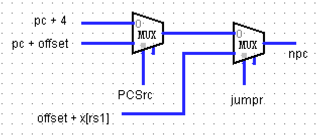

- 之后还是`jalr`的问题，由于寄存器的下沿读入，导致`pc`会因为寄存器中值的改变而在一个时钟周期内产生两次改变，最终跳转到错误的位置。因此在此处定义了一个`alu_pc`寄存器，在每次时钟上沿存入`x[rs1]`的值，从而防止多次读取

实际CPU的RTL逻辑电路：

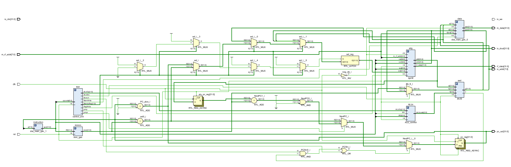

CPU的模块内容叙述完毕，下面为PDU的介绍以及连接

***

### PDU模块以及相应端口介绍

#### PDU模块介绍

- 控制CPU的运行方式：run = 1 连续运行，0 单步运行
- 管理外设 (开关sw、指示灯led、数码管an & seg)
- 显示运行结果和数据通路状态

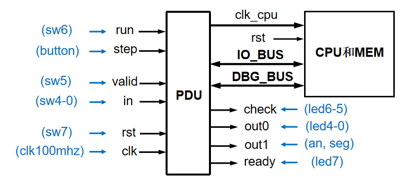

- PDU的逻辑结构如下：

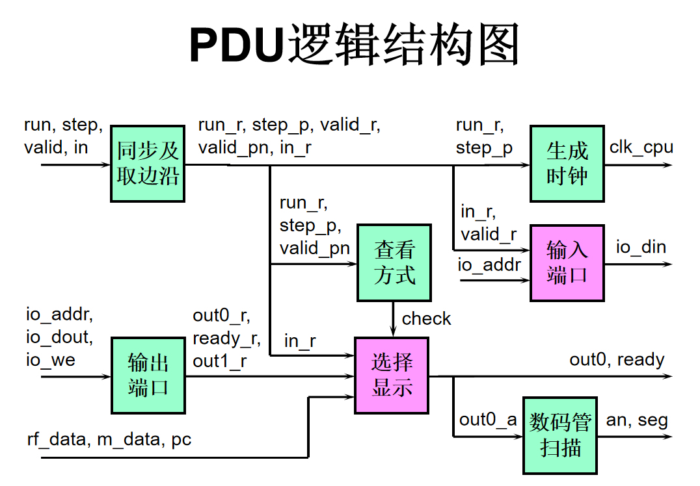

#### 主要端口介绍

##### DBG_BUS信号

调试时将存储器和寄存器堆内容，以及CPU数据通路状态信息导出显示
- m_rf_addr：存储器(MEM)或寄存器堆(RF)的调试读口地址
- rf_data：从RF读取的数据
- m_data：从MEM读取的数据
- pc：PC的内容

##### IO_BUS信号

CPU运行时访问开关(sw)、指示灯(led)和数码管(an, seg）
- io_addr：I/O外设的地址
- io_din：CPU接收来自输入缓冲寄存器（IBR）的sw输入数据
- io_dout：CPU向led和seg输出的数据
- io_we：CPU向led和seg输出时的使能信号，利用该信号将io_dout存入输出缓冲寄存器（OBR），再经数码管显示电路将其显示在数码管（an，seg）

从而可以得出，CPU的所有端口如下：

```verilog
module  cpu (
  input clk, 
  input rst,

  //IO_BUS
  output [7:0] io_addr,      //led和seg的地址
  output [31:0] io_dout,     //输出led和seg的数据
  output io_we,                 //输出led和seg数据时的使能信号
  input [31:0] io_din,          //来自sw的输入数据

  //Debug_BUS
  input [7:0] m_rf_addr,   //存储器(MEM)或寄存器堆(RF)的调试读口地址
  output [31:0] rf_data,    //从RF读取的数据
  output [31:0] m_data,    //从MEM读取的数据
  output [31:0] pc_out             //PC的内容
);
```

#### PDU模块结构化描述：

- 同步输入信号

```verilog
always @(posedge clk) begin
  run_r <= run;
  step_r <= step;
  step_2r <= step_r;
  valid_r <= valid;
  valid_2r <= valid_r;
  in_r <= in;           
end
```

- CPU工作方式

```verilog
always @(posedge clk, posedge rst) begin
  if(rst)
    clk_cpu_r <= 0;
  else if (run_r)
    clk_cpu_r <= ~clk_cpu_r;
  else
    clk_cpu_r <= step_p;
end
```

  - run = 1：连续运行
    - PDU向CPU输出连续时钟信号clk_cpu
    - CPU通过I/O_BUS访问外设
    - 输入端口：in，valid
    - 输出端口：out0, out1, ready
  - run = 0：单步运行（每次执行一条指令）
    - 每按动step一次，PDU产生一个周期的clk_cpu
    - 执行外设输入指令前，应先设置好valid或in后，再按动step
    - 执行任何指令后，led和数码管(an, seg)显示当前程序运行结果
    - 随后可以通过改变valid和in查看寄存器堆、存储器和PC的内容


- 读、写外设端口
  
```verilog
//读外设端口
always @* begin
  case (io_addr)
    8'h0c: io_din_a = {{27{1'b0}}, in_r};
    8'h10: io_din_a = {{31{1'b0}}, valid_r};
    default: io_din_a = 32'h0000_0000;
  endcase
end

//写外设端口
always @(posedge clk, posedge rst) begin
if (rst) begin
  out0_r <= 5'h1f;
  out1_r <= 32'h1234_5678;
  ready_r <= 1'b1;
end
else if (io_we)
  case (io_addr)
    8'h00: out0_r <= io_dout[4:0];
    8'h04: ready_r <= io_dout[0];
    8'h08: out1_r <= io_dout;
    default: ;
  endcase
end
```

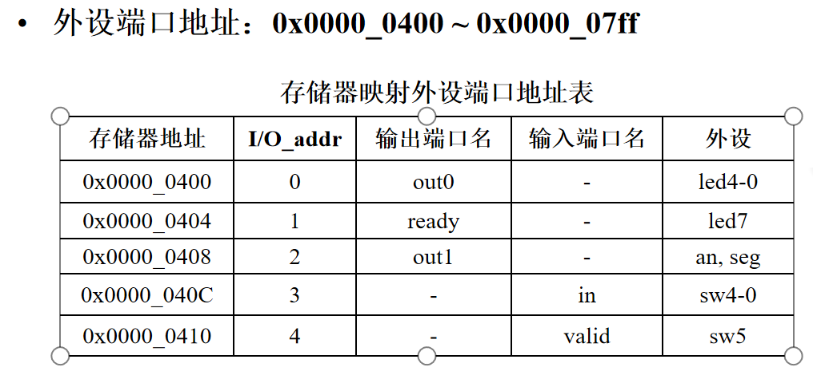

此处外设地址在cpu中的体现在于此：

```verilog
assign Memsrc = (~ALUout[10] && ALUOp == 2'b00) & MemWrite;
assign readdata = (ALUout[10] && ALUOp == 2'b00) ? io_din : dm;
assign io_we = MemWrite & (ALUout[10] && ALUOp == 2'b00);
```

- 最后是时分复用的显示界面：

```verilog
//LED和数码管查看类型
always @(posedge clk, posedge rst) begin
if(rst)
    check_r <= 2'b00;            
  else if(run_r)
    check_r <= 2'b00;
  else if (step_p)
    check_r <= 2'b00;
  else if (valid_pn)
    check_r <= check - 2'b01;
end

//LED和数码管显示内容
always @* begin
  ready_a = 1'b0;
  case (check_r)
    2'b00: begin
      out0_a = out0_r;
      out1_a = out1_r;
      ready_a = ready_r; 
    end
    2'b01: begin
      out0_a = in_r;
      out1_a = rf_data;
    end
    2'b10: begin
      out0_a = in_r;
      out1_a = m_data;
    end
    2'b11: begin
      out0_a = 5'b00000;
      out1_a = pc;
    end
  endcase
end

//扫描数码管
always @(posedge clk, posedge rst) begin
  if (rst) cnt <= 20'h0_0000;
  else cnt <= cnt + 20'h0_0001;
end

always @* begin
  case (an)
    3'd0: seg_a = out1_a[3:0];
    3'd1: seg_a = out1_a[7:4];
    3'd2: seg_a = out1_a[11:8];
    3'd3: seg_a = out1_a[15:12];
    3'd4: seg_a = out1_a[19:16];
    3'd5: seg_a = out1_a[23:20];
    3'd6: seg_a = out1_a[27:24];
    3'd7: seg_a = out1_a[31:28];
    default: ;
  endcase
end
```

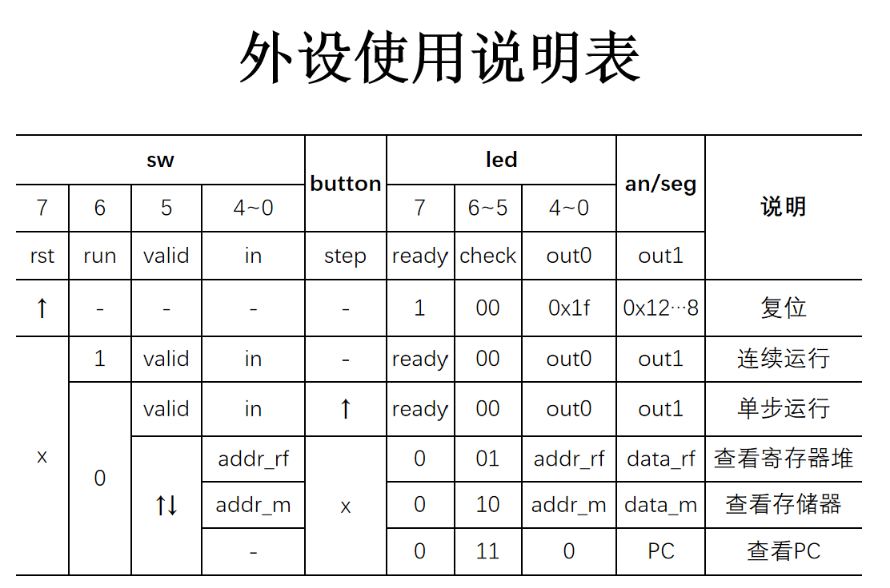

以上就是全部关于PDU模块的介绍。

***

### 实验结果展示 

#### CPU仿真以及仿真例程

首先是仿真例程，在rars软件上编写，如下：

```
.data
out: .word 0xff 	#led, 初始全亮
in: .word 0x01 		#switch

.text
la a0, out		#仿真需要

sw x0, 0(a0) 		#test sw: 全灭led

addi t0, x0, 0xff 	#test addi: 全亮led
sw t0, 0(a0)

lw t0, 4(a0) 		#test lw: 由switch设置led
sw t0, 0(a0)

andi t0, x0, 0x00       #test add: 半亮前led
addi t1, x0, 0x0f
add t0, x0, t1
sw t0, 0(a0) 
      
beq t0, t1, sign1      #test beq: 半亮后led
sign1:
addi t0, x0, 0xf0
sw t0, 0(a0)
      
jal x1, sign2         #test jal: 半亮中led

addi t0, x0, 0xc0    #test blt: 亮边界led
addi t1, x0, 0x03
blt t1, t0, sign3
sign3:
add t0, t0, t1
sw t0, 0(a0)

sign2:
addi t0, x0, 0x3c
sw t0, 0(a0)   
jalr x1            #test jalr: 返回正确的位置
```

共需测试10条指令，仿真波形如下：

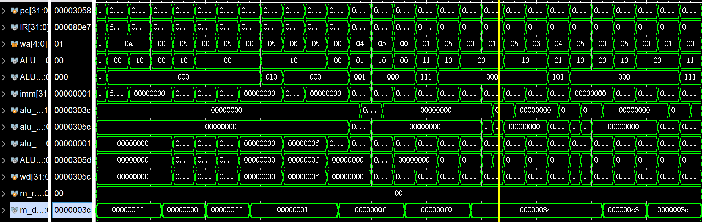

这里仿真时将`m_rf_addr`设为0，观察`m_data`的值即可。可以发现程序成功运行。

最后是在FPGAOL上的测试，这里使用的是老师的例程，附带有斐波那契—卢卡斯数列的计算。程序流程框图如下：

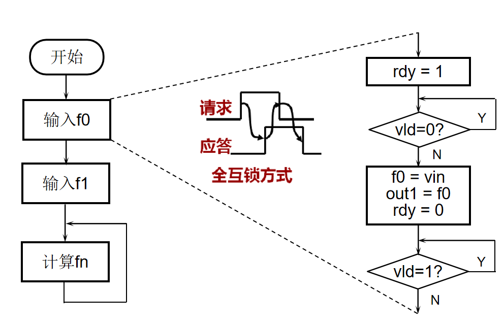

实际代码如下：

```.text
    addi x1, x0, 1    #x1=1
    add t1, x0, x0    #store fib series @t1

#### input f0
    sw x1, 0x404(x0)  #rdy=1
l1: 
    lw t0, 0x410(x0)  #wait vld=1
#    addi a7, x0, 5    #for debug begin
#    ecall
#    mv t0, a0         #for debug end
   
    beq t0, x0, l1
    lw s0, 0x40c(x0)  #s0=vin
#    addi a7, x0, 5    #for debug begin
#    ecall
#    mv s0, a0         #for debug end
    
    sw s0, 0x408(x0)  #out1=f0
    sw s0, 0(t1)      #store f0
    addi t1, t1, 4
    
    sw x0, 0x404(x0)  #rdy=0
l2:
    lw t0, 0x410(x0)  #wait vld=0
#    addi a7, x0, 5    #for debug begin
#    ecall
#    mv t0, a0         #for debug end
 
    beq t0, x1, l2
    
#### input f1
    sw x1, 0x404(x0)  #rdy=1
l3:
    lw t0, 0x410(x0)  #wait vld=1
#    addi a7, x0, 5    #for debug begin
#    ecall
#    mv t0, a0         #for debug end
 
    beq t0, x0, l3
    lw s1, 0x40c(x0)  #s1=vin
#    addi a7, x0, 5    #for debug begin
#    ecall
#    mv s1, a0         #for debug end
     
    sw s1, 0x408(x0)  #out1=f1
    sw s1, 0(t1)      #store f1
    addi t1, t1, 4
   
    sw x0, 0x404(x0)  #rdy=0
l4:
    lw t0, 0x410(x0)  #wait vld=0
#    addi a7, x0, 5    #for debug begin
#    ecall
#    mv t0, a0         #for debug end
 
    beq t0, x1, l4 
      
#### comput fi = fi-2 + fi-1
next:
    add t0, s0, s1    #fi
    sw t0, 0x408(x0)  #out1=fi
    sw t0, 0(t1)      #store fi
    addi t1, t1, 4

    add s0, x0, s1
    add s1, x0, t0

    sw x1, 0x404(x0)  #rdy=1
l5:
    lw t0, 0x410(x0)  #wait vld=1
#    addi a7, x0, 5    #for debug begin
#    ecall
#    mv t0, a0         #for debug end
 
    beq t0, x0, l5
    sw x0, 0x404(x0)  #rdy=0
l6:
    lw t0, 0x410(x0)  #wait vld=0
#    addi a7, x0, 5    #for debug begin
#    ecall
#    mv t0, a0         #for debug end
 
    beq t0, x1, l6
    jal x0, next       
```

在FPGAOL上的运行结果如下：

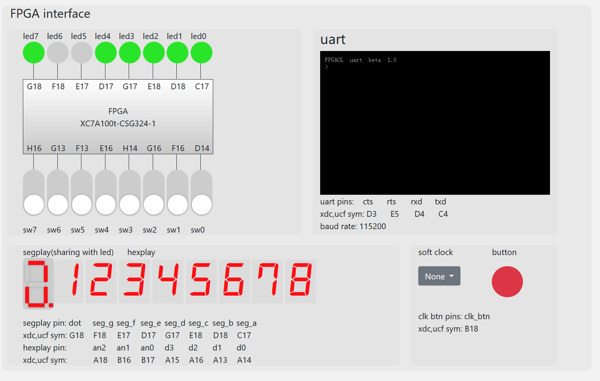

上图为，初始化CPU后的显示

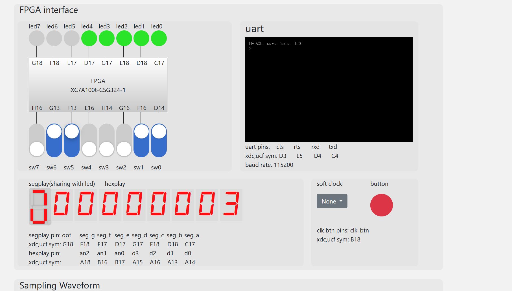

调整CPU运行模式为连续运行，利用`valid`的输入和汇编程序中的判断来进行阶段的递进。上图为输入数列第一项为3。


输入数列第二项为4。

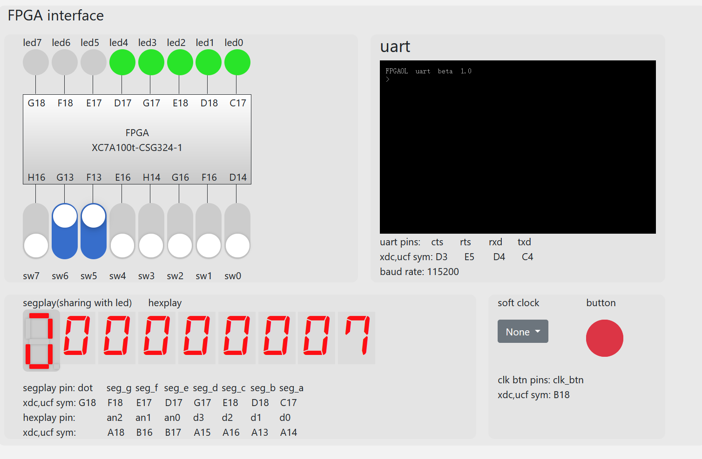

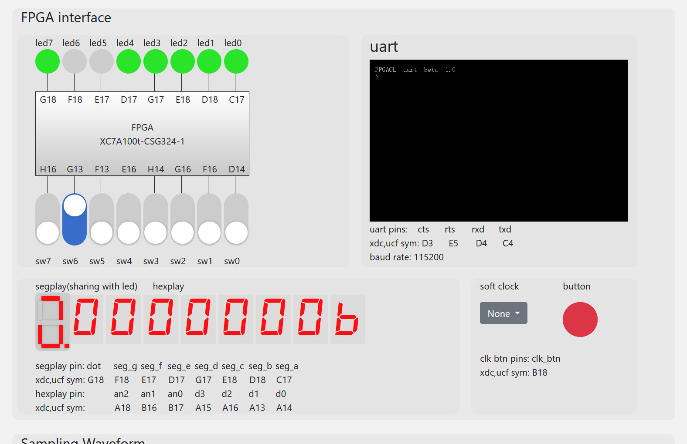

以上两图为利用valid键进行控制计算输出第三项、第四项的过程。说明程序在cpu中运行正确，cpu功能正确，与pdu的连接也正确。

综上，本次实验必做、选做部分全部完成。

### 实验总结

- 本次实验任务量适中，给了两周时间实现单周期CPU还是比较充裕的。并且，数据通路基本给出了，只有两个指令的数据通路待补充，写起来也很方便。

- 本次实验除了CPU设计实践以外，还收获到了很多关于I/O设备的知识，以及老师PDU模块的搭建思路，受益匪浅