# 计算机组成原理 实验报告
***

### 姓名：陈奕衡

### 学号：PB20000024

## 一、实验题目

- 实验五  流水线CPU设计

## 二、实验目的

- 理解流水线CPU的结构和工作原理
- 掌握流水线CPU的设计和调试方法，特别是流水线中数据相关和控制相关的处理
- 熟练掌握数据通路和控制器的设计和描述方法


## 三、实验平台

- ISE / Vivado（暂不支持其他Verilog HDL开发环境的检查）
- fpgaol 平台

## 四、实验过程

### 修改Lab4寄存器堆模块，使其满足写优先(Write First)，即在对同一寄存器读写时，写数据可立即从读数据输出

修改后的寄存器堆文件如下：
``` verilog
module register_pile #(parameter WIDTH = 32)(
    input clk, rst, we,
    input [4:0] ra0, ra1, wa, m_rf_addr,
    input [WIDTH - 1:0] wd,
    output reg [WIDTH - 1:0] rd0, rd1, rf_data 
);

reg [WIDTH - 1:0] regfile [0:31];
integer i;

always @ (*) begin
    if (ra0 == 5'b0) rd0 = 0;
    else if (we & (ra0 == wa)) rd0 = wd;
    else rd0 = regfile[ra0];

    if (ra1 == 5'b0) rd1 = 0;
    else if (we & (ra1 == wa)) rd1 = wd;
    else rd1 = regfile[ra1];

    if (m_rf_addr == 5'b0) rf_data = 0;
    else if (we & (m_rf_addr == wa)) rf_data = wd;
    else rf_data = regfile[m_rf_addr];
end

always @(posedge clk or posedge rst) begin
    regfile[0] = 32'h00000000;
    if(rst) begin
        for(i = 1; i < 32; i = i + 1)
            regfile[i] <= 32'h00000000;
    end
    else if(we && wa) begin
        regfile[wa] <= wd;
    end
end

endmodule

```

相比于单周期寄存器堆，这里添加条件判断语句以进行将写入数据直接赋值给读出数据的功能，实现先写后读。

***

### 设计完整的流水线CPU

由于大部分功能原件都已经在上次实验中写好，因此本次不再做详细介绍，主要围绕流水线中的各寄存器段、三种冒险以及解决方案进行介绍

首先基于如下数据通路进行流水线分段操作：

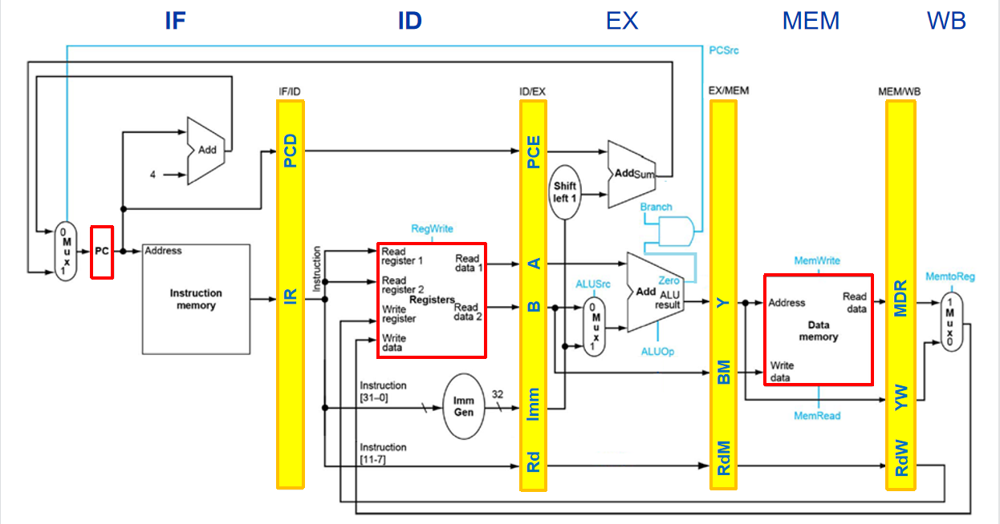

#### `IF/ID`寄存器段

该模块需要传递的值如下：

``` verilog
always @(posedge clk or posedge rst) begin //IF/ID reg
    if (rst || flush) begin
        IR_reg <= 32'h00000000;
        pc_IF <= 32'h00000000; 
        PCP_IF <= 32'h00000000;
    end 
    else if (stall || ((count || stallb) && Branch)) begin
        IR_reg <= IR_reg;
        pc_IF <= pc_IF;
        PCP_IF <= PCP_IF;
    end else begin
        IR_reg <= IR;
        pc_IF <= pc;
        PCP_IF <= PC_plus;
    end
end   
```
 - 根据`pc`值从内存中取出的指令IR
 - 在ID阶段需要进行跳转时所需的`pc`
 - 在WB阶段由`jal`指令写回寄存器的`pc + 4`值
 - 该段寄存器还需接收`flush`信号和`stall`信号应对分支预测失败以及停顿

#### `ID/EX`寄存器段

该模块需要传递的值如下：

```verilog
always @(posedge clk or posedge rst) begin //ID/EX reg
    if(rst || (stall || ((count || stallb) && Branch))) begin
        pc_ID <= 32'h00000000;
        imm_ID <= 32'h00000000;
        rd_ID <= 32'h00000000;
        sig_ID <= 32'h00000000;
        rd0_reg <= 32'h00000000;
        rd1_reg <= 32'h00000000;
        func3_7 <= 4'h0;
        PCP_ID <= 32'h00000000;
        ctrl_reg <= 32'h00000000;
        rs1_reg <= 5'h00;
        rs2_reg <= 5'h00;
    end else begin
        ctrl_reg <= {stall, stallb, flush, forwardC, forwardA, forwardD, forwardB, 
                     1'b0, sig[0], sig[2:1], 2'b00, sig[4], sig[3], 3'b000,
                     sig[7], sig[6:5]}; 
        PCP_ID <= PCP_IF;
        pc_ID <= pc_IF;
        imm_ID <= imm_w;
        rd_ID <= rd_reg;
        sig_ID <= sig;
        rd0_reg <= rd0;
        rd1_reg <= rd1;
        func3_7 <= {IR_reg[30], IR_reg[14:12]}; 
        rs1_reg <= rs1;
        rs2_reg <= rs2;
    end
end
```

- 继续传递由`jal`指令写回寄存器的`pc + 4`值
- 在EX阶段需要用到的`ALU_a`、`ALU_b`、`imm`值
- `control_unit`译码出的各种信号
- 在EX阶段进一步译码所需的`func3`和`func7`字段
- 后续前递模块所需的寄存器的值
- debug所需的`control`信号
- 该段寄存器同样需接收`stall`信号应对停顿
- 在WB阶段所需的`rd`寄存器地址

#### `EX/MEM` 模块

该模块需要传递的值如下：

```verilog
always @(posedge clk or posedge rst) begin //EX/MEM reg
    if(rst) begin
        PCP_EX <= 32'h000000000;
        rd_EX <= 32'h00000000;
        sig_EX <= 32'h00000000;
        ALUout_reg <= 32'h00000000;
        wd_reg <= 32'h00000000;
        ALUOp_reg <= 2'h0;
        ctrl_EX <= 32'h00000000;
        rd1_EX <= 32'h00000000;
    end else begin
        ctrl_EX <= ctrl_reg;
        ALUOp_reg <= ALUOp;
        PCP_EX <= PCP_ID;
        rd_EX <= rd_ID;
        sig_EX <= sig_ID[4:0];
        ALUout_reg <= ALUout;
        wd_reg <= alu_bm;
        rd1_EX <= rd1_reg;
    end
end
```

- 继续传递由`jal`指令写回寄存器的`pc + 4`值
- EX阶段得到的`ALU_out`的结果
- debug信号的`control`值
- MEM阶段所需的`rs2`所读出的数据
- 继续传递在WB阶段所需的`rd`寄存器地址
- 继续传递debug所需的`control`信号
- 后续阶段所需的信号

#### `MEM/WB`模块

该模块需要传递的值如下：

```verilog
always @(posedge clk or posedge rst) begin //MEM/WB reg
    if(rst) begin
        PCP_MEM <= 32'h00000000;
        ReadData_reg <= 32'h00000000;
        rd_MEM <= 32'h00000000;
        sig_MEM <= 32'h00000000;
        wb_reg <= 32'h00000000;
        ctrl_MEM <= 32'h00000000;
        ALUOp_MEM <= 32'h00000000;
        iod <= 32'h00000000;
        memw <= 1'b0;
    end else begin
        memw <= MemWrite;
        iod <= wd_reg;
        ALUOp_MEM <= ALUOp_reg;
        ctrl_MEM <= ctrl_EX;
        PCP_MEM <= PCP_EX;
        wb_reg <= ALUout_reg;
        rd_MEM <= rd_EX;
        sig_MEM <= sig_EX[2:0];
        ReadData_reg <= ReadData;
    end
end
```

- 外设所需的`MemWrite`与`ALU_opcode`信号
- 继续传递在WB阶段所需的`rd`寄存器地址
- 继续传递debug所需的`control`信号
- 继续传递由`jal`指令写回寄存器的`pc + 4`值
- 从数据内存中读取的数据
- 传递由ALU模块计算得出的写回结果

以上便是所有的段寄存器，之后便需要处理三种冒险。由于采用哈佛结构，数据内存与指令内存相分离，从而不存在结构冒险，下面针对数据冒险与控制冒险进行阐述。

#### 数据冒险模块

数据冒险模块解决的主要是数据前递以及停顿的问题。下面首先介绍数据前递问题。

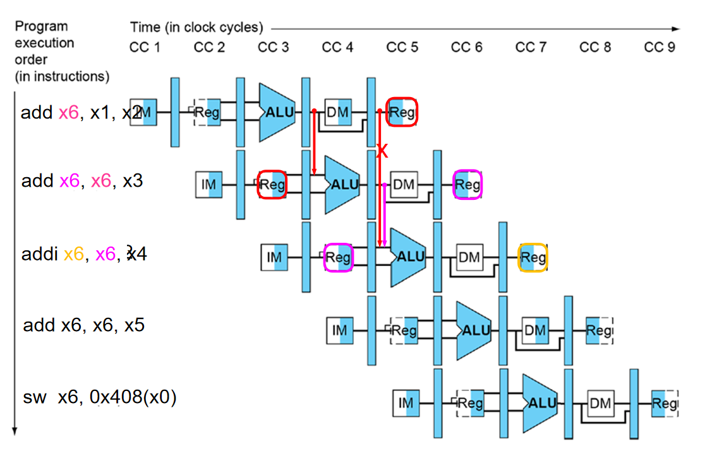

如上所示，由于写回寄存器的内容至少要到EX阶段结束才会有，因此存在两种情况：MEM阶段的前递与WB阶段前递。这里的实现方式如下：

```verilog
always @(*) begin
    if (rst) begin
        forwardA = 2'b00;
    end
    else if (wb_EX && (rd_EX != 0)
              && (rd_EX == rs1_reg)) begin
        forwardA = 2'b10;
    end 
    else if (wb_MEM && (rd_MEM != 0) 
              && (rd_MEM == rs1_reg)) begin
        forwardA = 2'b01;
    end 
    else begin
        forwardA = 2'b00;
    end
end

always @(*) begin
    if (rst) begin
        forwardB = 2'b00;
    end
    else if (wb_EX && (rd_EX != 0)
              && (rd_EX == rs2_reg)) begin
        forwardB = 2'b10;
    end 
    else if (wb_MEM && (rd_MEM != 0)
              && (rd_MEM == rs2_reg)) begin
        forwardB = 2'b01;
    end 
    else begin
        forwardB = 2'b00;
    end
end
```

根据`foward`信号对于数据的选择情况如下：

```verilog
always @(*) begin
    if(rst) begin
        alu_a = 0; alu_bm = 0;
    end else begin
        case(forwardA)
        2'b00: alu_a = rd0_reg;
        2'b01: alu_a = wd;
        2'b10: alu_a = ALUout_reg;
        default: alu_a = rd0_reg;
        endcase
        case(forwardB)
        2'b00: alu_bm = rd1_reg;
        2'b01: alu_bm = wd;
        2'b10: alu_bm = ALUout_reg;
        default: alu_bm = rd1_reg;
        endcase
    end
end
```

之后是停顿问题，停顿问题主要是针对`lw`指令的，具体情况如下图。

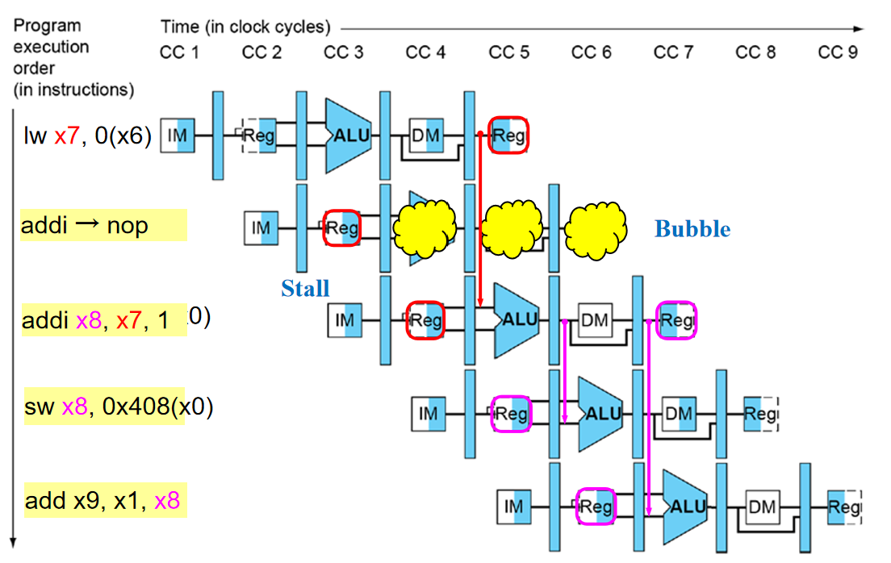

停顿逻辑如下：

```verilog
always @(*) begin
    if (rst) begin
        stall = 0; 
    end 
    else if (MemRead && (rd_ID != 5'h00) &&
            ((rd_ID == rs1) || (rd_ID == rs2))) begin
        stall = 1;
    end else begin
        stall = 0;
    end
end
```

可以从IF/ID和ID/EX寄存器段看到stall信号所产生的影响。

#### 控制冒险模块

控制冒险模块解决的主要是分支预测，这里并没有采用ripes中的相应分以预测结构，而是跟书中分支预测提前一致。因此，此处的beq指令的计算并没有使用ALU，而是提前到了ID段用相等比较器实现。这样所带来的好处是：即使分支预测失败，也只会损失一个指令周期而非两个，虽然还需要添加更多的前递、停顿逻辑，但还是在整体上提升了CPU的性能。

```verilog
assign PCSrc = ((beq_rs1 == beq_rs2) && Branch) || jump;
assign flush = (PCSrc && !(stall || ((count || stallb) && Branch))) ? 1 : 0;
assign NextPC = (PCSrc) ? PC_imm : PC_plus;
```

下面解释beq_rs1和beq_rs2的数据冒险：

```verilog
always @(*) begin
    if(rst) begin
        beq_rs1 = 0; beq_rs2 = 0;
    end else begin
        case(forwardC)
        2'b00: beq_rs1 = rd0;
        2'b01: beq_rs1 = wd;
        2'b10: beq_rs1 = ALUout_reg;
        default: beq_rs1 = rd0;
        endcase
        case(forwardD)
        2'b00: beq_rs2 = rd1;
        2'b01: beq_rs2 = wd;
        2'b10: beq_rs2 = ALUout_reg;
        default: beq_rs2 = rd1;
        endcase
    end
end
```

以上为前递模块的获取，与ALU模块相同，存在两种情况，即从`ALUout`的位置前递和从MEM阶段寄存器前递。下面为`forwardC`与`forwardD`信号的判断：

```verilog
always @(*) begin
    if (rst) begin
        forwardC = 2'b00;
    end
    else if (wb_EX && (rd_EX != 0)
              && (rd_EX == rs1)) begin
        forwardC = 2'b10;
    end 
    else if (wb_MEM && (rd_MEM != 0)
              && (rd_MEM == rs1)) begin
        forwardC = 2'b01;
    end 
    else begin
        forwardC = 2'b00;
    end
end

always @(*) begin
    if (rst) begin
        forwardD = 2'b00;
    end
    else if (wb_EX && (rd_EX != 0)
              && (rd_EX == rs2)) begin
        forwardD = 2'b10;
    end 
    else if (wb_MEM && (rd_MEM != 0)
              && (rd_MEM == rs2)) begin
        forwardD = 2'b01;
    end 
    else begin
        forwardD = 2'b00;
    end
end
```

下面是相关的停顿模块，这里与ALU模块的停顿不同的是，由于计算提前到了ID阶段执行，`lw`指令需要进行两次停顿，并且还需对普通运算指令停顿一个周期以获得`ALUout`的结果。代码如下：

```verilog
always @(*) begin
    if(rst) begin
        stallb = 0;
    end
    else if (MemRead && (rd_ID != 5'h00) &&
            ((rd_ID == rs1) || (rd_ID == rs2))) begin
        stallb = 2'b10;
    end 
    else if (RegWrite && (rd_ID != 5'h00) &&
            ((rd_ID == rs1) || (rd_ID == rs2))) begin
        stallb = 2'b01;
    end else begin
        stallb = 2'b00;
    end
end
```

停顿两个周期的办法是增加一个`count`寄存器用来表示需要额外停顿的周期数（因为`stall`信号本身就会使CPU停顿一个周期，所以`count`只用记录额外停顿的周期）：

```verilog
always @(posedge clk or posedge rst) begin
    if(rst) begin
        count <= 0;
    end 
    else if(stallb == 2'b10) begin
        count <= 1;
    end else begin
        count <= 0;
    end
end
```

通过以上方式便可以实现静态分支预测（分支不发生）。

#### CPU的主体数据通路

CPU的主体数据通路如下：

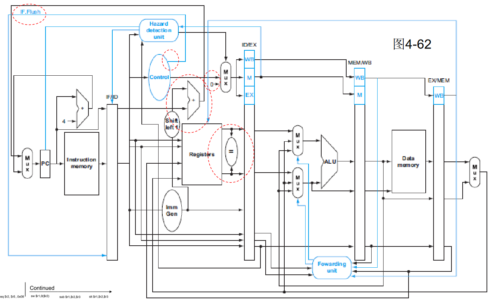

在上图中有少许改动：
 - 首先是判断相等时需接入相应的前递、停顿信号
 - 还有`jal`指令一直传递写回的`PC_plus`信号
 - 最后是在ID段寄存器传递之前，还需添加模块来确定指令中`rs1`、`rs2`或者`rd`是否存在，以防影响后面的前递模块判断。

```verilog
always @(*) begin
    if(rst || ~rs2s) begin
        rs2 = 5'h00;
    end else begin
        rs2 = IR_reg[24:20];
    end
    if(rst || ~rds) begin
        rd_reg = 5'h00;
    end else begin
        rd_reg = IR_reg[11:7]; 
    end
    if(rst || jump) begin
        rs1 = 5'h00;
    end else begin
        rs1 = IR_reg[19:15];
    end   
end
```

以上为指令是否存在相应寄存器的判断。

***

### PDU模块以及相应端口介绍

#### PDU模块介绍

- 控制CPU的运行方式：run = 1 连续运行，0 单步运行
- 管理外设 (开关sw、指示灯led、数码管an & seg)
- 显示运行结果和数据通路状态

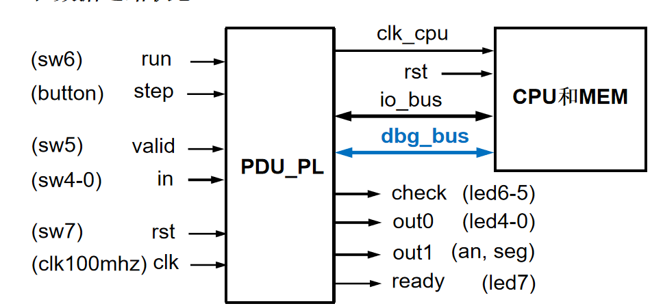

#### 主要端口介绍

##### DBG_BUS信号

调试时将存储器和寄存器堆内容，以及CPU数据通路状态信息导出显示
- m_rf_addr：存储器(MEM)或寄存器堆(RF)的调试读口地址
- rf_data：从RF读取的数据
- m_data：从MEM读取的数据
- 流水段寄存器
  - PC/IF/ID：pcin, pc, pcd, ir
  - ID/EX：pce, a, b, imm, rd, ctrl
  - EX/MEM：y, bm, rdm, ctrlm
  - MEM/WB：yw, mdr, rdw, ctrlw


##### IO_BUS信号

CPU运行时访问开关(sw)、指示灯(led)和数码管(an, seg）
- io_addr：I/O外设的地址
- io_din：CPU接收来自输入缓冲寄存器（IBR）的sw输入数据
- io_dout：CPU向led和seg输出的数据
- io_we：CPU向led和seg输出时的使能信号，利用该信号将io_dout存入输出缓冲寄存器（OBR），再经数码管显示电路将其显示在数码管（an，seg）

从而可以得出，CPU的所有端口如下：

```verilog
module  cpu (
  input clk, 
  input rst,

  //IO_BUS
  output [7:0] io_addr,      //led和seg的地址
  output [31:0] io_dout,     //输出led和seg的数据
  output io_we,                 //输出led和seg数据时的使能信号
  input [31:0] io_din,          //来自sw的输入数据

  //Debug_BUS
  input [7:0] m_rf_addr,   //存储器(MEM)或寄存器堆(RF)的调试读口地址
  output [31:0] rf_data,    //从RF读取的数据
  output [31:0] m_data,    //从MEM读取的数据
  
  output [31:0] pcin, pc, pcd, pce,
  output [31:0] ir, imm, mdr,
  output [31:0] a, b, y, bm, yw,
  output [4:0]  rd, rdm, rdw,
  output [31:0] ctrl, ctrlm, ctrlw    
);
```

#### PDU模块结构化描述：

- 同步输入信号

```verilog
always @(posedge clk) begin
  run_r <= run;
  step_r <= step;
  step_2r <= step_r;
  valid_r <= valid;
  valid_2r <= valid_r;
  in_r <= in;           
end
```

- CPU工作方式

```verilog
always @(posedge clk, posedge rst) begin
  if(rst)
    clk_cpu_r <= 0;
  else if (run_r)
    clk_cpu_r <= ~clk_cpu_r;
  else
    clk_cpu_r <= step_p;
end
```

  - run = 1：连续运行
    - PDU向CPU输出连续时钟信号clk_cpu
    - CPU通过I/O_BUS访问外设
    - 输入端口：in，valid
    - 输出端口：out0, out1, ready
  - run = 0：单步运行（每次执行一条指令）
    - 每按动step一次，PDU产生一个周期的clk_cpu
    - 执行外设输入指令前，应先设置好valid或in后，再按动step
    - 执行任何指令后，led和数码管(an, seg)显示当前程序运行结果
    - 随后可以通过改变valid和in查看寄存器堆、存储器和PC的内容


- 读、写外设端口
  
```verilog
//读外设端口
always @* begin
  case (io_addr)
    8'h0c: io_din_a = {{27{1'b0}}, in_r};
    8'h10: io_din_a = {{31{1'b0}}, valid_r};
    default: io_din_a = 32'h0000_0000;
  endcase
end

//写外设端口
always @(posedge clk, posedge rst) begin
if (rst) begin
  out0_r <= 5'h1f;
  out1_r <= 32'h1234_5678;
  ready_r <= 1'b1;
end
else if (io_we)
  case (io_addr)
    8'h00: out0_r <= io_dout[4:0];
    8'h04: ready_r <= io_dout[0];
    8'h08: out1_r <= io_dout;
    default: ;
  endcase
end
```

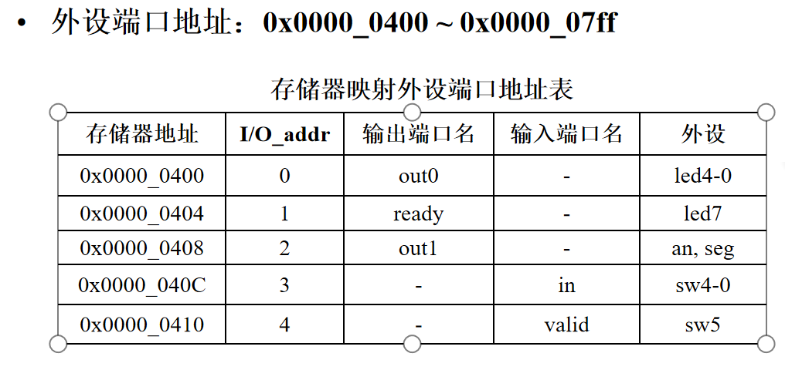

此处外设地址在cpu中的体现在于此：

```verilog
assign io_dout = iod;
assign io_addr = wb_reg[7:0];
assign MemSrc = ~ALUout_reg[10] & MemWrite;
assign rdd = (wb_reg[10] & (ALUOp_MEM == 2'b00)) ? io_din : ReadData_reg;
assign io_we = memw & (wb_reg[10] & (ALUOp_MEM == 2'b00));
```

这里取用的全部是WB段的寄存器信号，目的是为了与`io_din`写入的信号同步，以防止外设信号因为在不同的阶段获取从而串位。

- 新填加有关于流水段寄存器的操作：

```verilog
//增加寄存器堆和存储器地址计数：依靠pre,next边沿计数使能
always @(posedge clk, posedge rst) begin
  if (rst) cnt_m_rf <= 5'b0_0000;
  else if (step_p)
	cnt_m_rf <= 5'b0_0000;
  else if (next_pn)
	cnt_m_rf <= cnt_m_rf + 5'b0_0001;
  else if (pre_pn)
	cnt_m_rf <= cnt_m_rf - 5'b0_0001;
end

//增加流水寄存器地址计数，流水线寄存器高两位地址依靠pre边沿计数，低三位地址依靠next边沿计数
always @(posedge clk, posedge rst) begin
  if (rst) cnt_ah_plr <= 2'b00;
  else if (step_p)
    cnt_ah_plr <= 2'b00;
  else if (pre_pn)
	cnt_ah_plr <= cnt_ah_plr + 2'b01;
end

always @(posedge clk, posedge rst) begin
  if (rst) cnt_al_plr <= 3'b000;
  else if (step_p)
	cnt_al_plr <= 3'b000;
  else if (next_pn)
	if (cnt_ah_plr==2'b01)
		if (cnt_al_plr == 3'b101)
			cnt_al_plr <= 3'b000;
		else cnt_al_plr <= cnt_al_plr + 3'b001;
	else begin
		cnt_al_plr [2] <= 1'b0;
		cnt_al_plr [1:0] <= cnt_al_plr[1:0] + 2'b01; 
	end
end

assign  addr_plr = {cnt_ah_plr,cnt_al_plr};  //增加流水线寄存器地址

//寄存器堆和存储器地址输出选择
//下面的always块也可以用assign m_rf_addr = {in_r[4:2],cnt_m_rf};代替因为寄存器堆只需要低5位就可以了，不关心高3位
always @(*) begin
  case (check_r[1])
    1'b0: 
	  m_rf_addr = {3'b000,cnt_m_rf};
    1'b1:
	  m_rf_addr = {in_r[4:2],cnt_m_rf};   
  endcase
end

//流水线寄存器数据选择输入
always @(*)begin
  case (cnt_ah_plr)
  //PC/IF/ID
  2'b00:
      case (cnt_al_plr[1:0])
      2'b00: plr_data = pc;
      2'b01: plr_data = pcd;
      2'b10: plr_data = ir;
      2'b11: plr_data = pcin;
      endcase
   //ID/EX 
   2'b01:
   begin
      case (cnt_al_plr)
      3'b000: plr_data = pce;
      3'b001: plr_data = a;
      3'b010: plr_data = b;
      3'b011: plr_data = imm;
      3'b100: plr_data = {{27{1'b0}},rd};
      3'b101: plr_data = ctrl;
      default: plr_data = pce;
      endcase
    end
    //EX/MEM
    2'b10:
      case (cnt_al_plr[1:0])
      2'b00: plr_data = y;
      2'b01: plr_data = bm;
      2'b10: plr_data = {{27{1'b0}},rdm};
      2'b11: plr_data = ctrlm;
      endcase
    //MEM/WB
    2'b11:
      case (cnt_al_plr[1:0])
      2'b00: plr_data = yw;
      2'b01: plr_data = mdr;
      2'b10: plr_data = {{27{1'b0}},rdw};
      2'b11: plr_data = ctrlw;
      endcase
    endcase
end
```

查看流水线寄存器的方式如下：

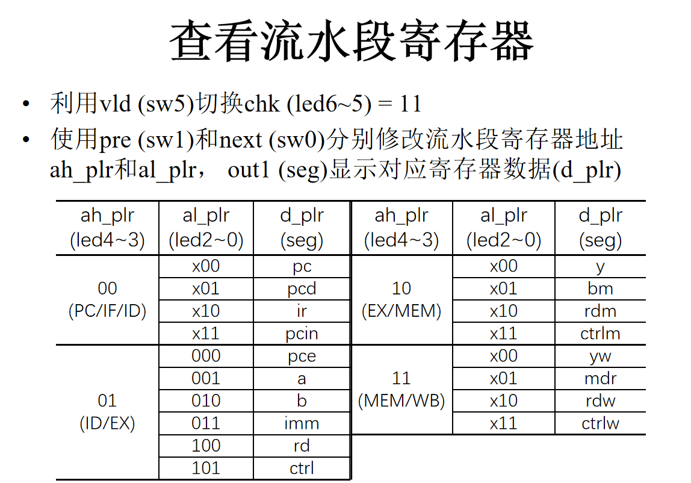

- 最后是时分复用的显示界面：

```verilog
//LED和数码管显示内容
always @(*)begin
  case (check_r)
    2'b00: begin
      out0_a = out0_r;
      out1_a = out1_r;
    end
    2'b01: begin
      out0_a = cnt_m_rf;
      out1_a = rf_data;
    end
    2'b10: begin
      out0_a = cnt_m_rf;
      out1_a = m_data;
    end
    2'b11: begin
      out0_a = addr_plr;
      out1_a = plr_data;    //更改为流水线寄存器地址和数据显示
    end
  endcase
end

//扫描数码管
always @(posedge clk, posedge rst) begin
  if (rst) cnt <= 20'h0_0000;
  else cnt <= cnt + 20'h0_0001;
end

always @* begin
  case (an)
    3'd0: seg_a = out1_a[3:0];
    3'd1: seg_a = out1_a[7:4];
    3'd2: seg_a = out1_a[11:8];
    3'd3: seg_a = out1_a[15:12];
    3'd4: seg_a = out1_a[19:16];
    3'd5: seg_a = out1_a[23:20];
    3'd6: seg_a = out1_a[27:24];
    3'd7: seg_a = out1_a[31:28];
    default: ;
  endcase
end
```

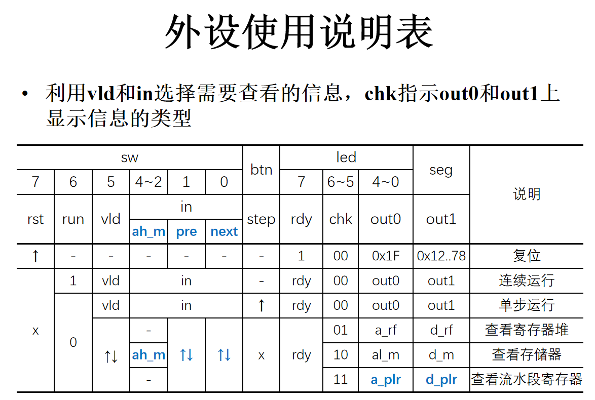

以上就是全部关于PDU模块的介绍。

***

### 实验结果展示 

#### CPU仿真以及仿真例程

首先是仿真例程，在rars软件上编写，分为三个部分，如下：

无任何冒险的程序如下

```
.text
main:
sw x0, 0x408(x0)  
addi t0,x0,0
addi t1,x0,0
addi t2,x0,0
lw  t0, 0x40C(x0) 
addi  t1,x0,5
addi  t2,x0,8
sw t0,0x408(x0)
sw t1, 0x408(x0)
add t3,t1,t2
sw t2,0x408(x0)
addi t0, x0,0
sw t3,0x408(x0)
```

共需测试6条指令，仿真波形如下：

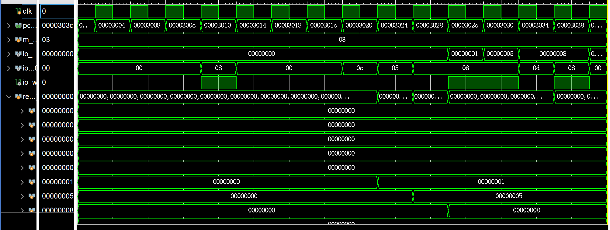
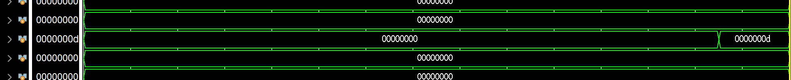

可以看到正确的t1、t2、t3寄存器的修改。

含有冒险的程序如下：

```
start:
sw x0, 0x408(x0)    #out1=0

#test data hazards
addi x1, x0, 1  #x1=1
addi x2, x1, 1  #x2=2
add x3, x1, x2  #x3=3
add x4, x1, x3  #x4=4
add x5, x1, x4  #x5=5
sw x5, 0x408(x0) #out1=5

add x6, x1, x2  #x6=3
add x6, x6, x3  #x6=6
add x6, x6, x4  #x6=10
add x6, x6, x5  #x6=15
sw x6, 0x408(x0)    #out1=15

#test load-use hazard
lw x7, 0x40C(x0) #x7=in
addi x8, x7, 1   #x8=in+1
addi x9, x8, -1  #x9=in
sw x9, 0x408(x0)    #out1=in

#test control hazard
beq x9, x0, start  #if (in==0) start
add x10, x9, x5
add x10, x10, x6
sw x10, 0x408(x0)    #out1=in+20
stop: jal x0, stop

#do not execute
add x11, x9, x10
add x12, x10, x11
add x13, x11, x12
```

仿真结果如下：

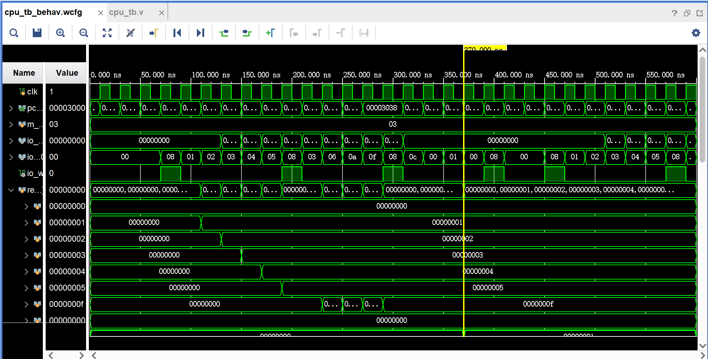

能够看到数据的前递与停顿正确进行，跳转也正确进行（pc值）

最后是斐波那契数列在fpgaol上的测试，代码如下：

```.text
.text
    addi x1, x0, 1    #x1=1
    add t1, x0, x0    #store fib series @t1

#### input f0
    sw x1, 0x404(x0)  #rdy=1
l1: 
    lw t0, 0x410(x0)  #wait vld=1
#    addi a7, x0, 5    #for debug begin
#    ecall
#    mv t0, a0         #for debug end
   
    beq t0, x0, l1
    lw s0, 0x40c(x0)  #s0=vin
#    addi a7, x0, 5    #for debug begin
#    ecall
#    mv s0, a0         #for debug end
    
    sw s0, 0x408(x0)  #out1=f0
    sw s0, 0(t1)      #store f0
    addi t1, t1, 4
    
    sw x0, 0x404(x0)  #rdy=0
l2:
    lw t0, 0x410(x0)  #wait vld=0
#    addi a7, x0, 5    #for debug begin
#    ecall
#    mv t0, a0         #for debug end
 
    beq t0, x1, l2
    
#### input f1
    sw x1, 0x404(x0)  #rdy=1
l3:
    lw t0, 0x410(x0)  #wait vld=1
#    addi a7, x0, 5    #for debug begin
#    ecall
#    mv t0, a0         #for debug end
 
    beq t0, x0, l3
    lw s1, 0x40c(x0)  #s1=vin
#    addi a7, x0, 5    #for debug begin
#    ecall
#    mv s1, a0         #for debug end
     
    sw s1, 0x408(x0)  #out1=f1
    sw s1, 0(t1)      #store f1
    addi t1, t1, 4
   
    sw x0, 0x404(x0)  #rdy=0
l4:
    lw t0, 0x410(x0)  #wait vld=0
#    addi a7, x0, 5    #for debug begin
#    ecall
#    mv t0, a0         #for debug end
 
    beq t0, x1, l4 
      
#### comput fi = fi-2 + fi-1
next:
    add t0, s0, s1    #fi
    sw t0, 0x408(x0)  #out1=fi
    sw t0, 0(t1)      #store fi
    addi t1, t1, 4

    add s0, x0, s1
    add s1, x0, t0

    sw x1, 0x404(x0)  #rdy=1
l5:
    lw t0, 0x410(x0)  #wait vld=1
#    addi a7, x0, 5    #for debug begin
#    ecall
#    mv t0, a0         #for debug end
 
    beq t0, x0, l5
    sw x0, 0x404(x0)  #rdy=0
l6:
    lw t0, 0x410(x0)  #wait vld=0
#    addi a7, x0, 5    #for debug begin
#    ecall
#    mv t0, a0         #for debug end
 
    beq t0, x1, l6
    jal x0, next       
     
```

在FPGAOL上的运行结果如下：

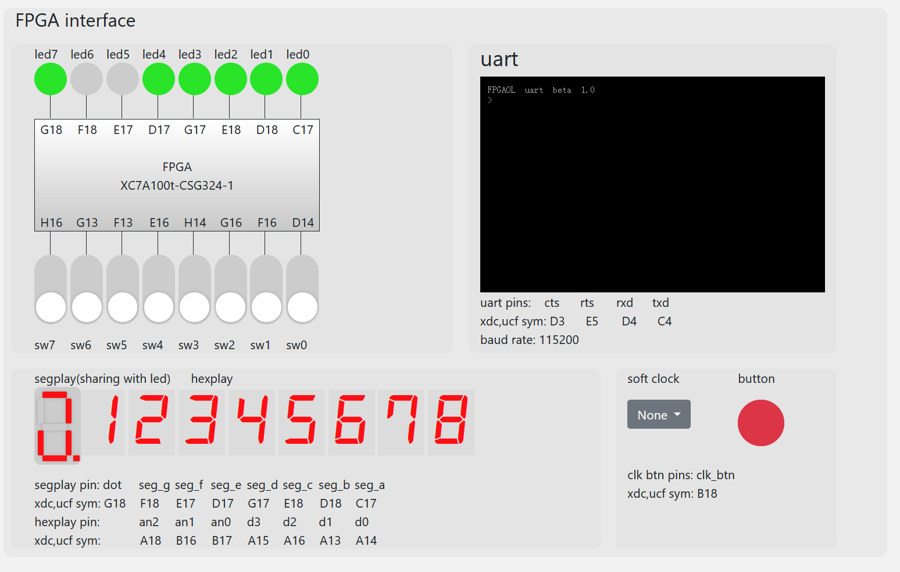

上图为，初始化CPU后的显示

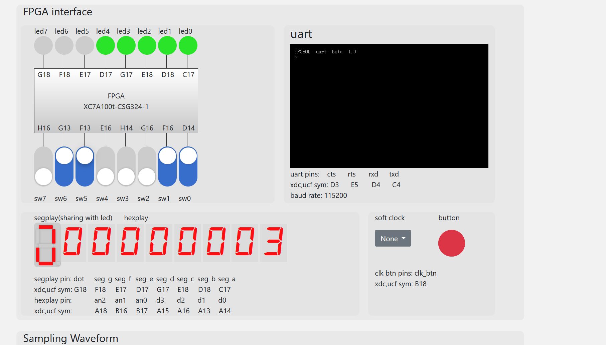

调整CPU运行模式为连续运行，利用`valid`的输入和汇编程序中的判断来进行阶段的递进。上图为输入数列第一项为3。

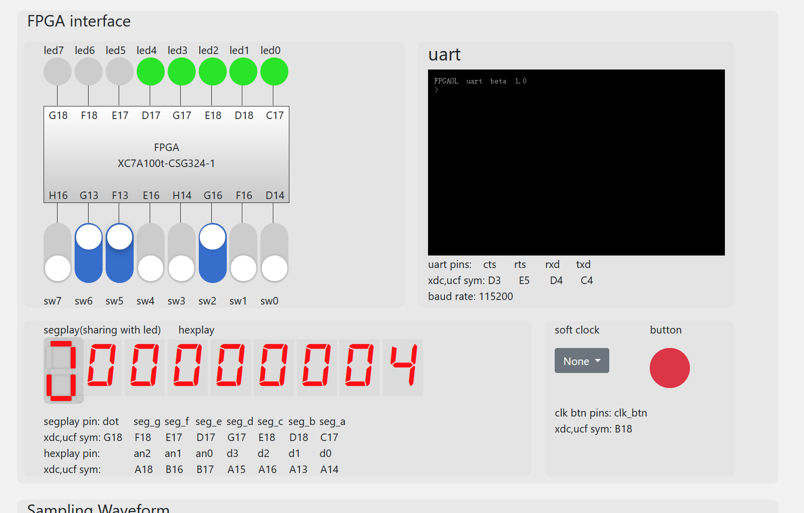

输入数列第二项为4。

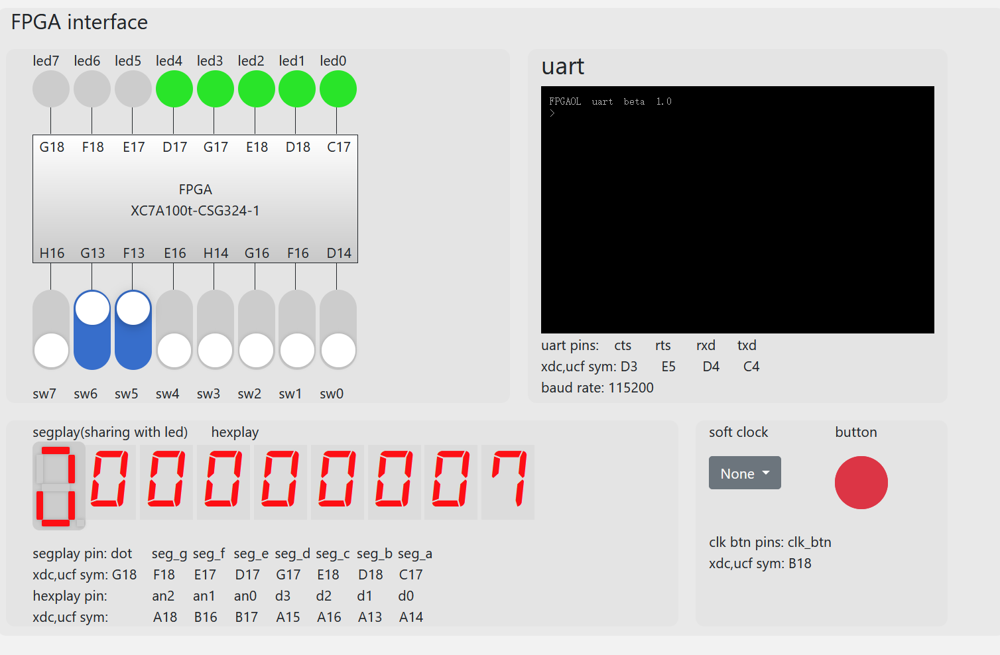

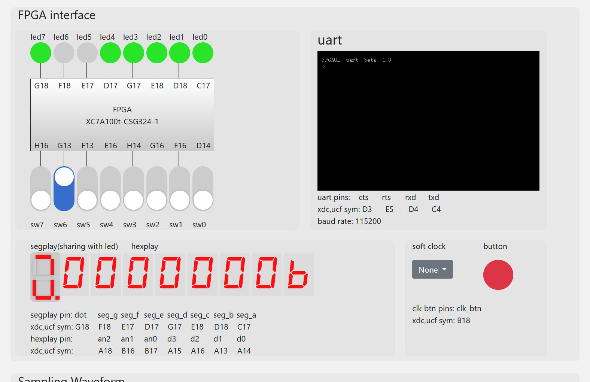

以上两图为利用valid键进行控制计算输出第三项、第四项的过程。说明程序在cpu中运行正确，cpu功能正确，与pdu的连接也正确。

综上，本次实验必做、选做部分全部完成。

### 实验总结

- 本次实验任务量较大，但是给了三周时间实现单周期CPU还是比较充裕的。这回并未给出相应具体的数据通路，只能根据书中大致的数据通路进行细节优化，还是比较耗时。并且，本次使用仿真debug的难度很高，同样是增加了实验难度。

- 本次实验让我了解了流水线CPU的简单设计，收获极大。