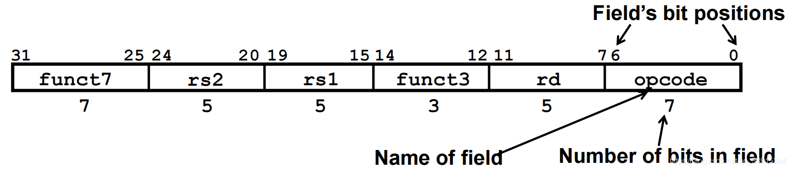

# 计算机组成原理 实验报告
***

### 姓名：陈奕衡

### 学号：PB20000024

## 一、实验题目

- 实验六  综合设计

## 二、实验目的

- 理解计算机硬件系统的组成结构和工作原理
- 掌握软硬件综合系统的设计和调试方法
- 进一步加深理解CPU中各模块设计的原理


## 三、实验平台

- ISE / Vivado（暂不支持其他Verilog HDL开发环境的检查）
- fpgaol 平台

## 四、实验过程

### 对R型指令和I型指令的拓展

R型指令的命令格式如下：



所有的R型指令如下：


包含了加法、减法、左移、大小比较、异或、右移、算术右移、或、与共10条指令

I型指令的命令格式如下：


所有的I型指令（除加载）如下：


包含了立即数加法、左移、大小比较、异或、右移、算术右移、或、与共9条指令

这两部分指令主要用于CPU的逻辑和加减运算

下面是对于ALU控制信号的拓展。这里的拓展方式是增加对于`function_3`字段的判断与拓宽`ALU_OP`信号至四位，修改后的ALU_control模块如下：

``` verilog
module ALU_control(
    input rst,
    input [2:0] IR3,
    input IR1,
    input [1:0] ALUOp,
    output [3:0] ALUcode
    );

reg [3:0] ALUcode_reg;
    
always @(*) begin
    if(rst) begin
        ALUcode_reg = 3'b111;        
    end else begin
        case(ALUOp)
            2'b10: begin //R-type
                case(IR3)
                    3'b000: begin //add
                        if(IR1) begin //sub
                             ALUcode_reg = 4'b0001;
                        end else begin
                             ALUcode_reg = 4'b0000;
                        end
                    end
                    3'b001: begin //left shift
                        ALUcode_reg = 4'b0101;
                    end
                    3'b010: begin //slt
                        ALUcode_reg = 4'b1001;
                    end
                    3'b011: begin //sltu
                        ALUcode_reg = 4'b1000;
                    end
                    3'b100: begin //xor
                        ALUcode_reg = 4'b0100;
                    end
                    3'b101: begin 
                        if(IR1) begin //sra
                             ALUcode_reg = 4'b0110;
                        end else begin //srl
                             ALUcode_reg = 4'b0111;
                        end
                    end
                    3'b111: begin //and
                        ALUcode_reg = 4'b0010;
                    end
                    3'b110: begin //or
                        ALUcode_reg = 4'b0011;
                    end
                endcase
            end
            2'b00: begin //lw,sw
                ALUcode_reg = 4'b0000;
            end
            2'b01: begin //beq
                ALUcode_reg = 4'b0001;
            end
            2'b11: begin //i type
                case(IR3)
                    3'b000: begin
                        ALUcode_reg = 4'b0000;
                    end
                    3'b111: begin
                        ALUcode_reg = 4'b0010;
                    end
                    3'b110: begin
                        ALUcode_reg = 4'b0011;
                    end
                    3'b001: begin //left shift
                        ALUcode_reg = 4'b0101;
                    end
                    3'b101: begin 
                        if(IR1) begin //sra
                             ALUcode_reg = 4'b0110;
                        end else begin //srl
                             ALUcode_reg = 4'b0111;
                        end
                    end
                    3'b010: begin //slt
                        ALUcode_reg = 4'b1001;
                    end
                    3'b011: begin //sltu
                        ALUcode_reg = 4'b1000;
                    end
                    3'b100: begin //xor
                        ALUcode_reg = 4'b0100;
                    end
                endcase
            end
        endcase
    end
end

assign ALUcode = ALUcode_reg;

endmodule
```

之后还需进行对于ALU模块的修改，如下所示：

``` verilog
module alu #(parameter WIDTH = 32)(
input   rst,
input  [WIDTH-1:0] a, b,	
input  [3:0] f,		
output  [WIDTH-1:0] y, 
output  z); 			

reg [WIDTH-1:0] temp;

always @(*) begin
    if(rst) begin
        temp = 0;
    end else begin
        case (f [3:0])
            4'b0000: temp = a + b;
            4'b0001: temp = a - b;
            4'b0010: temp = a & b;
            4'b0011: temp = a | b;
            4'b0100: temp = a ^ b;
            4'b0101: temp = a << b[4:0];
            4'b0110: temp = $signed(a) >>> b[4:0];
            4'b0111: temp = a >> b[4:0];
            4'b1000: temp = a < b;
            4'b1001: temp = $signed(a) < $signed(b);
            default: temp = 0;
        endcase 
    end
end

assign z = (temp) ? 0 : 1;
assign y = temp;

endmodule
```

综上便是关于运算指令的拓展

***

### S型指令与I-L型指令

这两类指令主要负责管理内存的写入和读出

S型指令格式如下：


所有S型指令如下：


共三条指令，分别负责写入字节，半字和单字

I-L型指令格式如下：


所有I-L型指令如下：


共五条指令，分别负责读取字节，无符号字节，半字，无符号半字和单字

下面是关于这两类指令的实现。这里需要将`function3`字段通过段间寄存器传至MEM阶段进行译码，从而判断存取指令

``` verilog
always @(*) begin
    case(func3_EX)
    3'b000: begin
        case(ALUout_reg[1:0])
        2'b00: wdr = {ReadData[31:8], wd_reg[7:0]};
        2'b01: wdr = {ReadData[31:16], wd_reg[7:0], ReadData[7:0]};
        2'b10: wdr = {ReadData[31:24], wd_reg[7:0], ReadData[15:0]};
        2'b11: wdr = {wd_reg[7:0], ReadData[23:0]};
        endcase
    end
    3'b001: begin       
        case(ALUout_reg[1:0])
        2'b00: wdr = {ReadData[31:16], wd_reg[15:0]};
        2'b10: wdr = {wd_reg[15:0], ReadData[15:0]};
        default: wdr = 0;
        endcase
    end
    3'b010: wdr = wd_reg;
    default: wdr = 0;
    endcase
end

always @(*) begin
    case(func3_EX)
    3'b000: begin
        case(ALUout_reg[1:0]) 
            2'b00: begin
                if(ReadData[7]) rdr = {24'hffffff, ReadData[7:0]};
                else rdr = {24'h000000, ReadData[7:0]};
            end
            2'b01: begin
                if(ReadData[15]) rdr = {24'hffffff, ReadData[15:8]};
                else rdr = {24'h000000, ReadData[15:8]};
            end
            2'b10: begin
                if(ReadData[23]) rdr = {24'hffffff, ReadData[23:16]};
                else rdr = {24'h000000, ReadData[23:16]};
            end
            2'b11: begin
                if(ReadData[31]) rdr = {24'hffffff, ReadData[31:24]};
                else rdr = {24'h000000, ReadData[31:24]};
            end
        endcase
    end
    3'b001:begin
        case(ALUout_reg[1:0]) 
            2'b00: begin
                if(ReadData[15]) rdr = {16'hffff, ReadData[15:0]};
                else rdr = {16'h0000, ReadData[15:0]};
            end
            2'b10: begin
                if(ReadData[31]) rdr = {16'hffff, ReadData[31:16]};
                else rdr = {16'h0000, ReadData[31:16]};
            end
        default: rdr = 0;
        endcase
    end
    3'b010: rdr = ReadData;
    3'b100: begin 
        case(ALUout_reg[1:0]) 
            2'b00: begin
                rdr = {24'h000000, ReadData[7:0]};
            end
            2'b01: begin
                rdr = {24'h000000, ReadData[15:8]};
            end
            2'b10: begin
                rdr = {24'h000000, ReadData[23:16]};
            end
            2'b11: begin
                rdr = {24'h000000, ReadData[31:24]};
            end
        endcase
    end
    3'b101: begin 
        case(ALUout_reg[1:0]) 
            2'b00: begin
                rdr = {16'h0000, ReadData[15:0]};
            end
            2'b10: begin
                rdr = {16'h0000, ReadData[31:16]};
            end
        default: rdr = 0;
        endcase
    end
    default: rdr = 0;
    endcase
end
```

增加如上模块便可以实现上述指令，进行数据从内存的存取。不过由于选择的分布式RAM的特性，还需增加一个类似于先写后读的模块。

```verilog
if(ra == ALUout_reg) begin
    ReadData_reg <= rr;
    flag <= 1;
end 
else if(flag) begin
    ReadData_reg <= ReadData_reg;
    flag <= 0;
end else begin
    ReadData_reg <= ReadData;
end

always @(posedge clk or posedge rst) begin
    if(rst) begin
        rr <= 0;
        ra <= 0;
    end 
    else if(MemWrite) begin
        rr <= wdr;
        ra <= ALUout_reg;
    end else begin
        rr <= rr;
        ra <= ra;
    end
end
```

***

#### B型指令

这类指令为条件分支指令，可以根据比较进行分支跳转

B型指令格式如下：


所有B型指令如下：


共五条指令，分别为相等跳转、不等跳转、小于跳转、大于等于跳转、以及相应的无符号小于和大于等于跳转

下面是对于B型指令的实现。这只需要在原先只判断等于的结构基础上增加判断即可。

新增模块如下：

``` verilog
module beq_judge(
    input rst,
    input [31:0] rs1, rs2,
    input [2:0] beq_sig,
    
    output beqsrc);

reg temp;

always@(*) begin
    if(rst) begin
        temp = 0;
    end 
        case(beq_sig) 
        3'b000: begin
            if(rs1 == rs2) temp = 1;
            else temp = 0;
        end
        3'b001:  begin
            if(rs1 != rs2) temp = 1;
            else temp = 0;
        end
        3'b100: begin
            if($signed(rs1) < $signed(rs2)) temp = 1;
            else temp = 0;
        end
        3'b101: begin
            if($signed(rs1) >= $signed(rs2)) temp = 1;
            else temp = 0;
        end 
        3'b110: begin
            if(rs1 < rs2) temp = 1;
            else temp = 0;
        end 
        3'b111: begin
            if(rs1 >= rs2) temp = 1;
            else temp = 0;
        end  
        default: temp = 0;  
        endcase
end

assign beqsrc = temp;

endmodule 
```
至此所有的B型指令全部实现

#### J型指令和U型指令

J型指令为无条件跳转指令，用于程序的直接跳转。这类指令一共有两条，分别为立即数跳转和寄存器加立即数跳转，如下所示：


这两条指令中的跳转操作可以直接利用beq的数据通路完成，但是写回则需要通过段间寄存器传递`pc + 4`的值。

U型指令同样只有两条指令，用于大地址的获取，如下所示：


上述指令由于需要向寄存器写回数值，并且不通过ALU模块，因此也需要进行前递操作，修改前递模块如下所示：

```verilog
always @(*) begin
    if(rst) begin
        alu_a = 0; alu_bm = 0;
    end else begin
        case(forwardA)
        2'b00: alu_a = rd0_reg;
        2'b01: alu_a = wd;
        2'b10: begin 
            if(sig_EX[2:1] == 2'b10) alu_a = PCP_EX;
            else if(sig_EX[2:1] == 2'b11) alu_a = ureg_EX;
            else alu_a = ALUout_reg;
        end
        default: alu_a = rd0_reg;
        endcase
        case(forwardB)
        2'b00: alu_bm = rd1_reg;
        2'b01: alu_bm = wd;
        2'b10: begin 
            if(sig_EX[2:1] == 2'b10) alu_bm = PCP_EX;
            else if(sig_EX[2:1] == 2'b11) alu_bm = ureg_EX;
            else alu_bm = ALUout_reg;
        end
        default: alu_bm = rd1_reg;
        endcase
    end
end
```

即需要在EX阶段进行一次`MemtoReg`信号的译码，从而让前递模块获得正确的寄存器值

#### 分支预测模块前移

将分支预测模块前移，能够减少分支预测失败而导致的周期损失，进一步提升CPU性能

分支预测提前最重要的问题是需要设计新的停顿和前递模块。此处前递模块和前方的一样，不需添加新的内容，而停顿模块需要进行改变。这里由于操作在ID段，因此需要在所需目标寄存器在EX段得出结果时停顿一个周期，在MEM段时停顿两个周期。

```verilog
always @(*) begin
    if(rst) begin
        beq_rs1 = 0; beq_rs2 = 0;
    end else begin
        case(forwardC)
        2'b00: beq_rs1 = rd0;
        2'b01: beq_rs1 = wd;
        2'b10: begin
            if(sig_EX[2:1] == 2'b10) beq_rs1 = PCP_EX; 
            else if(sig_EX[2:1] == 2'b11) beq_rs1 = ureg_EX;
            else beq_rs1 = ALUout_reg;
        end
        default: beq_rs1 = rd0;
        endcase
        case(forwardD)
        2'b00: beq_rs2 = rd1;
        2'b01: beq_rs2 = wd;
        2'b10:  begin
            if(sig_EX[2:1] == 2'b10) beq_rs2 = PCP_EX; 
            else if(sig_EX[2:1] == 2'b11) beq_rs2 = ureg_EX;
            else beq_rs2 = ALUout_reg;
        end
        default: beq_rs2 = rd1;
        endcase
    end
end
```

下面是多周期停顿所需计数器
```verilog
always @(posedge clk or posedge rst) begin
    if(rst) begin
        count <= 0;
    end 
    else if(stallb == 2'b10) begin
        count <= 1;
    end else begin
        count <= 0;
    end
end
```

如上便能实现分支预测前移

### 实验结果展示 

#### 仿真相应汇编测试程序

仿真例程分为三个部分，这里直接展示仿真结果（原始文件过大）：

- 第一部分成功标志


可以看到程序成功结束

含有冒险的程序如下：

- 第二部分成功标志


- 第三部分成功标志


该CPU已基本实现riscv指令集基本指令的各种操作

### 实验总结

- 本次实验任务量一般，经过两周时间进行指令拓展，虽然原始CPU存在各种bug，但还是成功跑完了三段例程，标志着基本指令集的实现

- 本次实验进一步让我理解各指令格式的用意以及各模块之间的关系，进一步加深了对CPU的理解