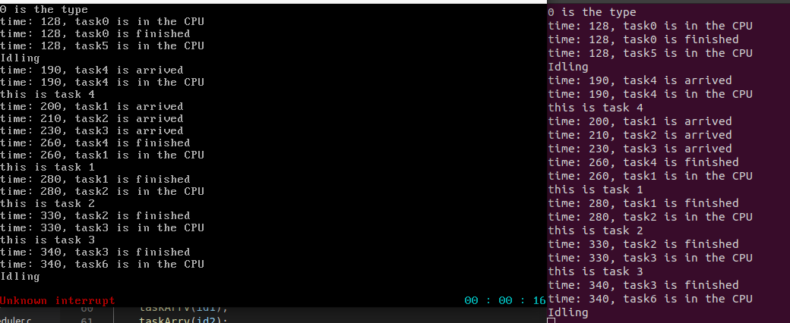
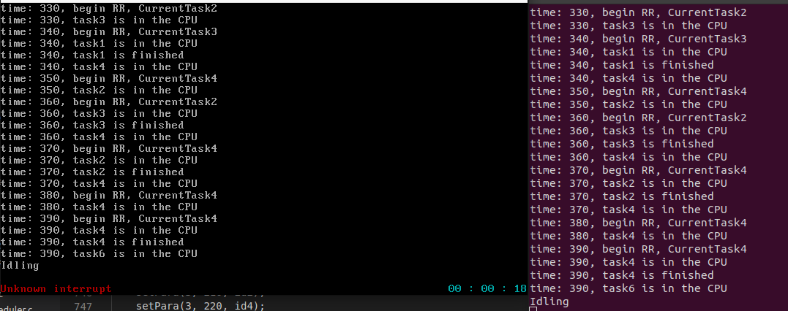

# 第六次实验报告

## 学号：PB20000024

## 姓名：陈奕衡
***

### 一、软件框图


本次实验是从lab4的示例代码开始，一起完成lab5和lab6的所有要求，其大体框架如上，包含了任务管理与维护和多种调度算法的实现，以及任务随时钟到达和完成，同时也为调度器封装好了接口。

这里的测试由于需要时钟同步，因此没有在shell内进行测试，而是在系统启动时进行测试。

### 二、主要功能模块说明

#### 任务创建与销毁

首先是任务（TCB）的数据结构，如下：

``` c
typedef enum state{
    ready, running, waiting, nopara
}state;

typedef struct myTCB{
    unsigned long tid;
    state TCBstate;
    unsigned long *stack;
    unsigned long *StackTop;
    tskPara *para;
}myTCB;

typedef struct tskPara {
    int priority;
    int exec_time;
    int arrv_time;
} tskPara;
```

包括有任务的id，任务状态，栈底，栈顶，以及参数（优先级，到达时间，执行时间）

下面解释一下任务的四个状态：

- `nopara`表示任务刚刚创建，还没有进行参数赋予
- `waiting`表示任务参数配置已好，等待直至到达时间时进入就绪队列
- `ready`表示任务已经进入就绪队列
- `running`表示任务正在被运行

进程池使用链式存储并进行维护：

```c
typedef struct TCBpool{
    myTCB *data;
    struct TCBpool *next;
}TCBpool;

extern TCBpool *PoolHead;
```

之后是任务的创建与销毁原语：

``` c
int createTsk(void (*tskBody)(void)){
    myTCB *new;
    new = (myTCB *)kmalloc(sizeof(myTCB));

    new->tid = id++;
    new->stack = (unsigned long *)kmalloc(STACK_SIZE);
    new->StackTop = (unsigned long *)new->stack + STACK_SIZE - 1;
    new->TCBstate = nopara;
    new->para = (tskPara *)kmalloc(sizeof(tskPara));
    initTskPara(new->para);
    stack_init(&new->StackTop, tskBody);

    TCBpool *newt;
    newt = (TCBpool *)kmalloc(sizeof(TCBpool));
    
    newt->data = new;
    newt->next = PoolHead->next;
    PoolHead->next = newt;

    return new->tid;
}

void destroyTsk(int tskIndex){
    TCBpool *temp, *prev;
    
    temp = PoolHead->next; prev = PoolHead;
    if (prev == NULL){
        return;
    }
    
    while (temp != NULL){
        if (temp->data->tid == tskIndex){
            break;
        }
        prev = temp;
        temp = temp->next;
    }    
    
    prev->next = temp->next;
    kfree((unsigned long)temp->data->stack);
    kfree((unsigned long)temp->data);
    kfree((unsigned long)temp);
    
    return;
}
```

#### 上下文切换和调度函数

上下文切换原语与PPT中的一致，并没有进行改变：

```
.text
.code32

.global CTX_SW
CTX_SW:
    pushf
    pusha
    movl prevTSK_StackPtrAddr,%eax
    movl %esp, (%eax)
    movl nextTSK_StackPtr, %esp
    popa
    popf
    ret
```

每次进行上下文切换的指针也没有进行改变：

```c
void context_switch(unsigned long **prevTskStkAddr, unsigned long *nextTskStk) {
    prevTSK_StackPtrAddr = prevTskStkAddr;
    nextTSK_StackPtr = nextTskStk;
    CTX_SW();
}
```

之后是总的调度函数（每种算法都会执行相同调度函数）：

```c
void schedule(void){    
    while (1){			
        myTCB *NextTask;            
        if (systemScheduler.IsEmpty()){
            TCBpool *temp;
    
            int id = createTsk(IdleTskBdy);
            temp = PoolHead->next;
            while (temp != NULL){
                if (temp->data->tid == id){
                    break;
                }
                temp = temp->next;
            }
            IdleTask = temp->data;
            NextTask = IdleTask;
            IdleId = id;
        } else{
            NextTask = systemScheduler.next_tsk();
        }           

        NextTask->TCBstate = running;
        CurrentTask = NextTask;
        myPrintk(0x7, "time: %d, task%d is in the CPU\n", tick_times, CurrentTask->tid);
                
        runtime = 0;
        context_switch(&BspContext, CurrentTask->StackTop);
    }	
}
```

- 这里由于每次进行上下文切换执行相应的任务，任务的栈指针会被破坏，这就导致了`IdleTask`需要在执行完成之后进行销毁，并且生成一个新的任务。
- 这里设置`runtime`为0是为了RR的时间片在调度一个新任务时起始时刻正常。
- 设置一个全局变量`CurrentTask`方便hook函数进行对当前任务的访问

最后说明一下`schedule`函数的调度位置是在每一次`TaskEnd()`函数中

#### 任务的启动、结束原语

```c
void tskStart(unsigned long id){
    TCBpool *temp;
    
    temp = PoolHead->next;
    while (temp != NULL){
        if (temp->data->tid == id){
            break;
        }
        temp = temp->next;
    }   

    temp->data->TCBstate = ready;
    systemScheduler.enqueue(temp->data);
    return;
}

void tskEnd(void){
    myTCB *node;
    if (CurrentTask != IdleTask){
        while (CurrentTask->para->exec_time > 0){
            continue;
        }
        myPrintk(0x7, "time: %d, task%d is finished\n", tick_times, (CurrentTask->tid));
        node = systemScheduler.dequeue();
    } else{
        node = IdleTask;
    }
    
    destroyTsk(node->tid);
    schedule();
    return;
}
```

启动时只进行入队与状态改变。结束时要结合时钟进行判断，出队并且销毁，之后进入调度函数。

#### 任务管理器初始化和进入多任务状态

```c
void startMultitask(void) {
    BspContextBase = (unsigned long *)kmalloc(5 * STACK_SIZE);
    BspContext = BspContextBase + STACK_SIZE - 1;
    CurrentTask = IdleTask;
    
    schedule();
}

void initTaskManager(void) {
    PoolHead = (TCBpool *)kmalloc(sizeof(TCBpool));
    PoolHead->next = NULL;

    initScheduler();
    InitId = createTsk(InitTskBdy);
    tskStart(InitId);
    startMultitask();

    return;
}
```

初始化时需要维护进程池，初始化调度函数，并且创建初始任务（运行`myMain()`函数）。进入多任务状态需要形成初始的上下文环境，并进入调度函数。

#### 就绪队列

首先是就绪队列的数据结构：

```c
typedef struct ReadyQueueNode{
    myTCB *TCB;
    struct ReadyQueueNode *next;
}ReadyQueueNode;

typedef struct ReadyQueue{
    ReadyQueueNode *head;
    ReadyQueueNode *tail;
}ReadyQueue;
```

之后是两种不同的出队入队方法：

- FCFS版：

```c
void enqueue(ReadyQueue *queue, myTCB *new){
    ReadyQueueNode *NewNode = (ReadyQueueNode *)kmalloc(sizeof(ReadyQueueNode));

    NewNode->TCB = new;
    NewNode->next = NULL;

    if (IsEmpty(queue)){
        queue->head = NewNode;
        queue->tail = NewNode;
    } else{
        queue->tail->next = NewNode;
        queue->tail = NewNode;
    }
    
    return;     
}

myTCB *dequeue(ReadyQueue *queue){
    if (IsEmpty(queue)){
        return NULL;
    }
    
    ReadyQueueNode *temp = queue->head;
    myTCB *node = temp->TCB;
    if (queue->head == queue->tail){
        queue->head = NULL;
        queue->tail = NULL;
    } else{
        queue->head = queue->head->next;
    }
    
    kfree((unsigned long)temp);
    return node;
}
```

- PRIORITY版：

```c
void PriEnqueue(ReadyQueue *queue, myTCB *new){
    ReadyQueueNode *NewNode = (ReadyQueueNode *)kmalloc(sizeof(ReadyQueueNode));
    ReadyQueueNode *temp = queue->head;

    NewNode->TCB = new;
    NewNode->next = NULL;

    if (IsEmpty(queue)){
        queue->head = NewNode;
        queue->tail = NewNode;
    } else{
        while (temp->next != NULL){
            if (new->para->priority > temp->next->TCB->para->priority){
                NewNode->next = temp->next;
                temp->next = NewNode;
                break;
            }
            temp = temp->next;
        }
        if (temp->next == NULL){
            queue->tail->next = NewNode;
            queue->tail = NewNode;
        }
    }

    return;  
}

myTCB *PriDequeue(ReadyQueue *queue){
    if (IsEmpty(queue)){
        return NULL;
    }
    
    ReadyQueueNode *temp = queue->head;
    myTCB *node = temp->TCB;
    if (queue->head == queue->tail){
        queue->head = NULL;
        queue->tail = NULL;
    } else{
        queue->head = queue->head->next;
    }
    
    kfree((unsigned long)temp);
    return node;
}
```

这里由于是在入队时已经排列好了相应的任务的优先级顺序，因此`NextTask`可以进行通用。

#### 调度器统一接口

调度器的数据结构与PPT中的一致：

```c
typedef struct scheduler {
    schedulerType type; 
    myTCB* (*next_tsk)(void);
    void (*enqueue)(myTCB*);
    myTCB* (*dequeue)(void);
    void (*init)(void);
    void (*tick_func)(void);
    // void (*sche)(void);
    void (*show)(void);
    int (*IsEmpty)(void);
} scheduler;

scheduler systemScheduler;
```

之后就需要对相应函数进行封装，这里用RR函数的封装举例：

```c
ReadyQueue RRQueue;

myTCB *NextTaskRR(void){
    return NextQueue(&RRQueue);
}

void EnqueueRR(myTCB *new){
    enqueue(&RRQueue, new);
    return;
}

myTCB *DequeueRR(void){
    return dequeue(&RRQueue);
}

void InitRR(void){
    initQueue(&RRQueue);
    return;
}

void ShowRR(void){
    ShowQueue(&RRQueue);
}

int IsemptyRR(void){
    IsEmpty(&RRQueue);
}
```

首先设置一个队列的全局变量，并利用每个函数对队列进行调用。最后在下图函数中进行初始化：

```c
void initScheduler(void){
    switch (systemScheduler.type){
        case FCFS:
            systemScheduler.init = InitFCFS;
            systemScheduler.enqueue = EnqueueFCFS;
            systemScheduler.dequeue = DequeueFCFS;
            systemScheduler.next_tsk = NextTaskFCFS;
            systemScheduler.show = ShowFCFS;
            systemScheduler.tick_func = 0;
            systemScheduler.IsEmpty = IsemptyFCFS;        
            break;
        case RR:
            systemScheduler.init = InitRR;
            systemScheduler.enqueue = EnqueueRR;
            systemScheduler.dequeue = DequeueRR;
            systemScheduler.next_tsk = NextTaskRR;
            systemScheduler.show = ShowRR;
            systemScheduler.tick_func = RRtick;
            append2hook(RRtick);
            systemScheduler.IsEmpty = IsemptyRR; 
            break;
        case PRI:
            systemScheduler.init = InitPRI;
            systemScheduler.enqueue = EnqueuePRI;
            systemScheduler.dequeue = DequeuePRI;
            systemScheduler.next_tsk = NextTaskPRI;
            systemScheduler.show = ShowPRI;
            systemScheduler.IsEmpty = IsemptyPRI;  
            systemScheduler.tick_func = 0;   
            break;
        default:
            systemScheduler.init = InitFCFS;
            systemScheduler.enqueue = EnqueueFCFS;
            systemScheduler.dequeue = DequeueFCFS;
            systemScheduler.next_tsk = NextTaskFCFS;
            systemScheduler.show = ShowFCFS;
            systemScheduler.IsEmpty = IsemptyFCFS;  
            systemScheduler.tick_func = 0;  
            break;
    }
    
    systemScheduler.init();
    return;
}
```

之后在`schedule()`函数中的调用全部采用`systemScheduler`实现

#### 参数统一接口

参数的统一接口如下：

```c
void initTskPara(tskPara *buffer){
    buffer->arrv_time = 0;
    buffer->exec_time = 0;
    buffer->priority = 0;

    return;
}

void setTskPara(unsigned int option, unsigned int value, tskPara *buffer){
    switch (option){
    case PRIORITY:
        buffer->priority = value;
        break;
    case EXETIME:
	    buffer->exec_time = value;
		break;
	case ARRTIME:
		buffer->arrv_time = value;
		break;
    default:
        break;
    }

    return;
}

void getTskPara(unsigned int option, unsigned int *para, tskPara *buffer){
    switch (option) {
		case PRIORITY:
			*para = buffer->priority;
            break;
		case EXETIME:
			*para = buffer->exec_time;
            break;
		case ARRTIME:
			*para = buffer->arrv_time;
            break;
		default:
			break;
	}

    return;
}
```

这里在`task()`中进行了一层封装：

```c
void setPara(unsigned long option, unsigned long value, unsigned long id){
    TCBpool *temp;   
    temp = PoolHead->next;
    
    while (temp != NULL){
        if (temp->data->tid == id){
            break;
        }
        temp = temp->next;
    }
    if (temp == NULL){
        return;
    }

    setTskPara(option, value, temp->data->para);

    return;
}

void getPara(unsigned long option, unsigned int *value, unsigned long id){
    TCBpool *temp;   
    temp = PoolHead->next;
    
    while (temp != NULL){
        if (temp->data->tid == id){
            break;
        }
        temp = temp->next;
    }
    if (temp == NULL){
        return;
    }

    getTskPara(option, value, temp->data->para);
}
```

#### 时钟相关函数

首先是检测到达时间的`arrival()`函数：

```c
void arrival(void){
    TCBpool *temp = PoolHead->next;

    if (temp == NULL){
        return;
    }
    while (temp != NULL){
        if ((temp->data->para->arrv_time == tick_times) && (temp->data->TCBstate == waiting)){
            if (temp->data->tid == IdleId && temp->data->tid == InitId){
                continue;
            }
            myPrintk(0x7, "time: %d, task%d is arrived\n", tick_times, (temp->data->tid));
            tskStart(temp->data->tid);
        }
        temp = temp->next;
    }
}
```

之后还有检测执行时间的`execution()`函数：

```c
void execution(void){
    if (!CurrentTask){
        return;
    }
    
    if(CurrentTask->para->exec_time > 0){
        CurrentTask->para->exec_time--;
        return;
    }
    else if (CurrentTask->para->exec_time == 0 && CurrentTask->tid != IdleId){
        myPrintk(0x7, "time: %d, task%d is finished\n", tick_times, (CurrentTask->tid));
    }  
}
```

最后是RR调度的`RRtick()`函数：

```c
void RRtick(void){
    if (CurrentTask == IdleTask){
        return;
    }

    if (runtime == TIMESLICE) {
		CurrentTask->TCBstate = ready;
		systemScheduler.enqueue(CurrentTask);
        systemScheduler.dequeue();
        myPrintk(0x7, "time: %d, begin RR, CurrentTask%d\n", tick_times, CurrentTask->tid);
		context_switch(&CurrentTask->StackTop, BspContext);
        runtime = 0;
	}
}
```

这里的实现机制是维护一个`runtime`全局变量，在每次`schedule()`和满足`RRtick()`条件时重置，实现任务随着时间进行抢占。

至此，主模块描述完毕，下面为主模块流程图：


### 四、组织说明

本实验组织架构如下(下图为主要修改部分）：


Makefile组织架构如下：


### 六、编译过程

编译所用脚本文件如下，在终端输入`./source2run.sh`便可一键编译加重定向串口：

```sh
#!/bin/bash
make clean
make

if [ $? -ne 0 ]; then
	echo "make failed"
else
	echo "make succeed"
	qemu-system-i386 -kernel output/myOS.elf -serial pty &
fi
```

编译完成之后，还需使用screen命令重定向串口至伪终端才能进行相应shell的交互操作。编译过程中由专属的elf文件对相应的Makefile进行连接并最后统一输出至output文件夹中。


上图为编译过后的部分.o文件结构。

### 实验结果

首先说明一下测试样例：

- FCFS

```c
    int id1 = createTsk(task1);
    int id2 = createTsk(task2);
    int id3 = createTsk(task3);
    int id4 = createTsk(task4);

    setPara(1, 5, id1);
    setPara(1, 3, id2);   
    setPara(1, 2, id4);
    setPara(1, 1, id3);

    setPara(2, 20, id1);
    setPara(2, 50, id2);   
    setPara(2, 70, id4);
    setPara(2, 10, id3);

    setPara(3, 200, id1);
    setPara(3, 210, id2);   
    setPara(3, 190, id4);
    setPara(3, 230, id3);
    
    taskArrv(id1);
    taskArrv(id2);
    taskArrv(id3); 
    taskArrv(id4);
```

其中`1`代表优先级，`2`代表执行时间，`3`代表到达时间。（这里的时间单位是一次`ticktime`，并不是秒）

运行后的实验结果如下：



首先可以看到首任务执行完成时间，之后新建了一个`task6`为`IdleTask`，并成功执行等待。等到190个tick时，任务陆续到达，并且按照先到先得的顺序执行，最后进入等待。

- PRI

```c
    int id1 = createTsk(task1);
    int id2 = createTsk(task2);
    int id3 = createTsk(task3);
    int id4 = createTsk(task4);

    setPara(1, 5, id1);
    setPara(1, 3, id2);   
    setPara(1, 2, id4);
    setPara(1, 1, id3);

    setPara(2, 20, id1);
    setPara(2, 50, id2);   
    setPara(2, 70, id4);
    setPara(2, 10, id3);

    setPara(3, 200, id1);
    setPara(3, 200, id2);   
    setPara(3, 200, id4);
    setPara(3, 200, id3);
    
    taskArrv(id1);
    taskArrv(id2);
    taskArrv(id3); 
    taskArrv(id4);
```

这里设置到达时间相同，方便进行优先级区分以及验证结果。

运行后的实验结果如下：


可以看出在同时到达时能够按照优先级进行顺序执行

- RR

```c
    int id1 = createTsk(task1);
    int id2 = createTsk(task2);
    int id3 = createTsk(task3);
    int id4 = createTsk(task4);

    setPara(1, 5, id4);
    setPara(1, 3, id2);   
    setPara(1, 2, id1);
    setPara(1, 1, id3);

    setPara(2, 40, id1);
    setPara(2, 50, id2);   
    setPara(2, 70, id4);
    setPara(2, 30, id3);

    setPara(3, 200, id1);
    setPara(3, 210, id2);   
    setPara(3, 220, id4);
    setPara(3, 230, id3);
    
    taskArrv(id1);
    taskArrv(id2);
    taskArrv(id3); 
    taskArrv(id4);
```

运行后的实验结果如下：



这里设置的时间片大小为10个`ticktime`，可以看到任务的有序轮转。（RR使用的是FIFO队列）

至此，实验全部完成

### 实验中遇到的问题

实验中在RR调度时，一开始没有注意上下文切换的问题，导致切换失败然后程序卡住，后面发现问题加入上下文换回才使程序运行成功。另外还有出队的问题，开始时出队在`tskEnd()`，导致RR时不能有效出队从而不能轮询，在该函数中加入出队解决问题。

```c
   if (runtime == TIMESLICE) {
		CurrentTask->TCBstate = ready;
		systemScheduler.enqueue(CurrentTask);
        systemScheduler.dequeue();
        myPrintk(0x7, "time: %d, begin RR, CurrentTask%d\n", tick_times, CurrentTask->tid);
		context_switch(&CurrentTask->StackTop, BspContext);
        runtime = 0;
	}
```